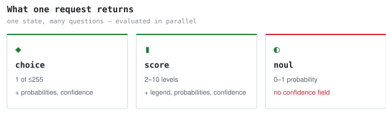
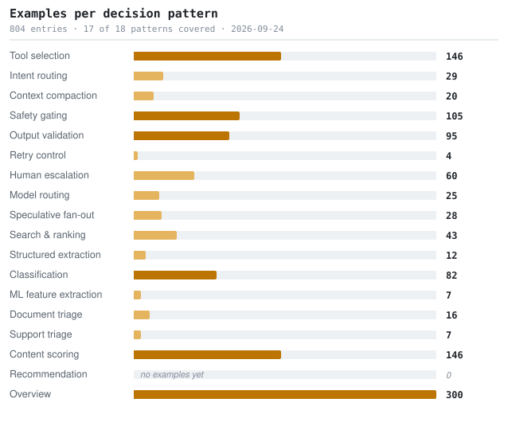

<!--
  This file is generated from catalog.json. Edit the catalog, then run `python3 scripts/build_readme.py`.
-->

# awesome-jev

**Every public example of Jev — TypeSafe AI's System One decision model — indexed by the decision it makes, not by the blog that mentioned it.**

      

[Searchable site](https://kydlikebtc.github.io/awesome-jev/) &nbsp;·&nbsp; [中文](README.zh-CN.md) &nbsp;·&nbsp; [Patterns](docs/patterns.md) &nbsp;·&nbsp; [Compatibility](docs/compatibility.md) &nbsp;·&nbsp; [Vetting](docs/vetting.md)

Filter by clicking a bar. Two more views: <a href="https://kydlikebtc.github.io/awesome-jev/?view=prims">primitives</a> · <a href="https://kydlikebtc.github.io/awesome-jev/?view=compat">compatibility</a>. Every filter and entry is a shareable URL.

---

## What this is

- **Jev** is a decision model from TypeSafe AI. It does not write text — you hand it state plus typed questions and it returns typed answers with calibrated confidence, fast and cheap enough to sit in an agent's inner loop.
- **This repo** indexes public examples of using it, organised by the *decision* being made. The resource you read this week is disposable; the decision pattern is not.
- **Why trust it:** every row names where it came from, says which primitives the code actually calls, and flags what a reader deserves to know before clicking. There are dozens of Jev lists — this one competes on verification, not on size.

> ⚠️ Not the product, not an SDK, not affiliated with TypeSafe AI, and not a recommendation. A row means the link resolved and a person read it — nothing more. See [what is verified](#what-is-verified-and-what-is-not).

## What Jev returns

Three primitives. Every pattern below is built out of them, and the asymmetry in the last row is the single most common source of bugs.

<picture>
  <source media="(prefers-color-scheme: dark)" srcset="docs/assets/primitives-en-dark.svg">
  
</picture>

Input is **text only** — string, JSON object, or array of text. Context is **64k** tokens per request, **32k** for the state plus the longest question. Output tokens are free. There are no published weights, so it cannot be run locally. Full cross-platform differences: [`docs/compatibility.md`](docs/compatibility.md).

## Start here

Six things in reading order. Hand-picked, because "most starred" is not the same as "read this first".

1. **[Quickstart](https://docs.typesafe.ai/introduction/quickstart)**
   The canonical first call: one support ticket, one Choice, one Score and one Noul in a single request, in Python, JS and cURL.

2. **[Jev 1.13 known limitations](https://docs.typesafe.ai/model-jaggedness/jev-1.13)**
   The most useful page in the docs and the least linked. It explains, among other things, that a Choice over options and one Noul per option answer different questions.

3. **[Example: three primitives in one request](https://github.com/kydlikebtc/awesome-jev/blob/main/examples/01-three-primitives/main.py)**
   Written from the official API reference and checked field by field against it, but not executed against the live API.

4. **[fast-jev-compaction](https://github.com/tamaratran/fast-jev-compaction)**
   Exactly two nouls per tool call: does knowing this call happened still matter, and is the full output still needed verbatim. Despite the word "scored" in its own description, no score primitive is used.

5. **[ai-cookbook: Jev track](https://github.com/daveebbelaar/ai-cookbook)**
   The best structured tutorial found. It states plainly that typed output does not guarantee a correct decision, lists the documented weaknesses, and qualifies its own cost illustration rather than selling it.

6. **[Hermes Agent: Jev compaction evaluation](https://github.com/NousResearch/hermes-agent)**
   The single most credible row in this catalog. Recall came out below their existing summariser, and at a matched context budget it tied plain recency ordering. Cost was genuinely far lower. Publishing a negative result on a hyped model is rare.

## Coverage

Every decision pattern, sized by how many examples exist. This doubles as the index — the names link to the sections below. A zero is a research gap, not a rendering bug.

<picture>
  <source media="(prefers-color-scheme: dark)" srcset="docs/assets/coverage-en-dark.svg">
  
</picture>

Two patterns have no examples yet. Both are plausible fits nobody appears to have published — see [`docs/status.md`](docs/status.md).

## Measured, not claimed

Almost every performance number circulating about this model is the vendor's own, produced with reference answers derived from other models' judgements rather than human ground truth. These are the independent measurements in the catalog — several are **negative results**, which is exactly why they are worth reading first.

- **[Hermes Agent: Jev compaction evaluation](https://github.com/NousResearch/hermes-agent)** — Ported the Jev compaction approach, measured it against their shipping summariser, and published the conclusion not to adopt it.
  `Benchmark` · ★247,803 · `Py` · `noul`
  The single most credible row in this catalog. Recall came out below their existing summariser, and at a matched context budget it tied plain recency ordering. Cost was genuinely far lower. Publishing a negative result on a hyped model is rare.

- **[worldmonitor: news threat classification](https://github.com/koala73/worldmonitor)** — Two Choice questions over threat level and category, held in shadow mode after a blind evaluation found Jev merely tied the incumbent model.
  `Benchmark` · ★87,175 · `TS` · `choice` · ⚠ `shadow mode`
  Wired in but deliberately inert: by their own statement nothing Jev returns reaches a label, a cache row or an alert. Ships a golden fixture. A model to copy for how to trial a new model without betting production on it.

- **[no-mistakes: review context selection](https://github.com/kunchenguid/no-mistakes)** — One Score per candidate file to pick review context, with a measured outcome: materially more billed input for essentially no wall-clock gain.
  `Benchmark` · ★8,595 · `Go` · `score`
  Their own recommendation was to keep the feature opt-in, off by default, and ship no savings claim. That is what an honest measurement looks like.

- **[Probing Jev's behaviour with repeated API calls](https://github.com/ahastudio/til)** — Independent Korean-language notes reporting that reversing the order of options shifted a probability enough to flip a 0.9 threshold.
  `Benchmark` · ★190 · `Py` · ⚠ `no licence` `unverified`
  The most actionable engineering caveat found anywhere: if option order alone can move a probability past your threshold, your threshold is not as stable as it looks. Independent and unreplicated, so treat the magnitude as indicative.

- **[An early-access test of TypeSafe's Jev: calibrated judgments for half a cent](https://lindfors.no/blog/a-first-look-at-typesafes-jev/)** — The best independent test found: 24 Norwegian documents on one pinned model version, opening with a case the model got wrong while correctly reporting low confidence.
  `Benchmark` · Lindfors
  Methodology is stated cleanly and scoped honestly as a single-day snapshot. Leading with a failure case is what makes it a real calibration test rather than a testimonial.

- **[Testing TypeSafe Jev, Mistral and Gemini for local event validation](https://nearhere.events/blog/typesafe-jev-mistral-gemini-event-validation)** — The only three-way head-to-head found, with each model's prompt tuned separately and the scope limited to one task rather than a general ranking.
  `Benchmark` · Near Here
  Self-limits correctly: a use-case study, not a model leaderboard. That restraint is rarer than the numbers.

## By decision pattern

The primary index. Each heading is a decision an agent has to make; the rows are examples of making it. Caveats appear as short tags — the full note for each row is in [`catalog.json`](catalog.json) and on [the site](https://kydlikebtc.github.io/awesome-jev/).

### Tool selection

_Which tool or action the agent should call next._

- **[Cookbook: Function calling](https://docs.typesafe.ai/cookbooks/function_calling)** ⭐ — Maps natural-language trading requests onto ordinary typed functions by turning function names and closed-set arguments into confidence-aware questions.
  `Official docs` · `Py` · `choice`

- **[Cookbook: Skill suggestion](https://docs.typesafe.ai/cookbooks/skill_suggestion)** ⭐ — Picks at most one skill out of 182 for an agent turn: one request ranks every skill and asks whether the turn needs one at all, a second reads the top three.
  `Official docs` · `Py` · `choice` · `noul`

- **[Demo: Smart home assistant](https://docs.typesafe.ai/demos/smart-home)** ⭐ — Runnable demo code for a smart home assistant that evaluates user requests with typed decisions.
  `Official docs` · `Py`

- **[claude-code-templates: three Jev plugins](https://github.com/davila7/claude-code-templates)** — Three independently installable Claude Code plugins — guardrails, model router and skill suggestion — each with its own hooks and tests.
  `Plugin` · ★30,896 · `Py` · `TS` · `choice` · `score` · `noul`

- **[Composio TypeSafe provider](https://github.com/ComposioHQ/composio/tree/next/python/providers/typesafe)** — Compiles a tool catalogue into questions and reconstructs tool calls from the answers, with typed errors for abstention and confirmation-required cases.
  `Project` · ★30,278 · `Py` · `choice`

- **[FastMCP jev_search transform](https://github.com/PrefectHQ/fastmcp/blob/main/fastmcp_slim/fastmcp/experimental/transforms/jev_search.py)** — Two-stage MCP tool search: a wide Choice coarse-ranks the whole catalogue, then a shortlist gets full descriptions plus one Noul each to decide whether it does the job at all.
  `Project` · ★27,847 · `Py` · `choice` · `noul`

- **[Cua driver: jev-use example](https://github.com/trycua/cua/tree/main/libs/cua-driver/examples/jev-use)** — Computer-use action selection in Python and TypeScript: Jev picks the next browser action from an immutable candidate set, with reobserve and abstain as reserved options.
  `Project` · ★25,737 · `Py` · `TS` · `choice`

- **[json-render](https://github.com/vercel-labs/json-render)** — Vercel Labs' generative UI framework. In its Jev experiment the model does not write JSON token by token — it only picks components, props and layout.
  `Project` · ★17,964 · Vercel Labs · `TS` · `choice`

- **[jev-ultrafast](https://github.com/browser-use/jev-ultrafast)** — A high-speed browser agent from Browser Use: Jev decides the operation and which element to act on, and a small LLM is called only when text must be typed.
  `Project` · ★16,069 · Browser Use · `Py` · `choice` · ⚠ `vendor numbers`

- **[DeepChat: agent tool-permission review](https://github.com/ThinkInAIXYZ/deepchat)** — Reviews each tool call on three axes — risk level, whether the user authorised it, and an explicit prompt-injection pressure check.
  `Project` · ★6,338 · `TS` · `choice` · `noul`

- **[jev-trader](https://github.com/jarrodwatts/jev-trader)** — High-frequency market making on a test network, deciding buy or sell from spread and trade direction.
  `Project` · ★1,871 · `TS` · `choice` · ⚠ `unverified`

- **[agent-desktop](https://github.com/lahfir/agent-desktop)** — Desktop automation that reads the system accessibility tree and decides which button, menu or field to act on next.
  `Project` · ★1,436 · `Rs` · `choice`

- **[Jev-cu](https://github.com/Sac-Y/Jev-cu)** — A computer-use agent that asks which accessibility-tree element to act on, plus a separate noul for whether the action needs explicit user confirmation.
  `Project` · ★547 · `JS` · `choice` · `noul` · ⚠ `no licence`

- **[hermes-jev-skills](https://github.com/kerpopule/hermes-jev-skills)** — Nine agent skills plus a CLI covering model routing, memory filtering, turn retention, one-of-many skill selection and next-action choice.
  `Plugin` · ★398 · `Py` · `choice` · `score` · `noul`

- **[typesafe-mario](https://github.com/fhshaik/typesafe-mario)** — Plays Super Mario Bros. from structured emulator RAM rather than screenshots, deciding run, jump and dodge.
  `Project` · ★336 · `Py` · `choice` · `score` · `noul` · ⚠ `code untested` `one commit` `no licence`

- **[jev-voice-browser](https://github.com/moritzkremb/jev-voice-browser)** — Voice-driven browser control where target criteria are rebuilt per request from the live element list, always including a none option.
  `Project` · ★212 · `JS` · `choice` · `score` · `noul`

- **[hyperedit](https://github.com/kevinbadi/hyperedit)** — An AI video editor routing an editing instruction to an operation, a target clip and a track, with a keyword router as fallback.
  `Project` · ★173 · `TS` · `choice` · `noul` · ⚠ `no licence`

- **[jevpilot](https://github.com/standardagents/jevpilot)** — A driving simulator autopilot asking two choices per tick, which short-circuits single-option questions locally instead of paying to send them.
  `Project` · ★152 · `JS` · `choice` · ⚠ `no licence`

- **[jev-drone](https://github.com/RomanSlack/jev-drone)** — Camera-only simulated drone where Jev makes tactical judgements at a low rate while stabilisation and safety reflexes stay in ordinary fast code.
  `Project` · ★117 · `Py` · `choice` · `score` · `noul` · ⚠ `unverified`

- **[jev-chat: a tool-calling chatbot with no LLM](https://github.com/w3cj/jev-chat)** — A chat bot that does tool calling with no language model anywhere: one request asks the request kind, the tool, and every tool's arguments at once.
  `Project` · ★83 · `TS` · `choice` · `noul`

- **[neo4jev](https://github.com/jexp/neo4jev)** — Puts Jev inside a knowledge graph traversal: at each node it decides which edge is most worth following.
  `Project` · ★79 · `Py` · `choice`

- **[OneVOneJev](https://github.com/emrickgarrett/OneVOneJev)** — A browser 1v1 FPS where every decision tick judges movement, view angle, aim, fire and jump.
  `Project` · ★18 · `TS` · `choice` · ⚠ `code untested` `no licence`

- **[Example: speculative fan-out](https://github.com/kydlikebtc/awesome-jev/blob/main/examples/03-fan-out/main.py)** — Asks for an operation plus a target for each operation it might have picked, so a browser step never needs a second round trip.
  `Snippet` · `Py` · `choice` · `noul` · ⚠ `code untested`

- **[Example: tool selection with a none option](https://github.com/kydlikebtc/awesome-jev/blob/main/examples/04-tool-selection/main.py)** — Pairs a choice over tools with a separate noul on whether a tool is needed at all, because those are different questions.
  `Snippet` · `Py` · `choice` · `noul` · ⚠ `code untested`

- **[Jev (Fully Tested) + Browser Use: FASTEST AI Agent I'VE TRIED YET!](https://www.youtube.com/watch?v=SNJ3yuJ_QwY)** — Wires Jev into Browser Use to drive a browser automation agent.
  `Video` · AICodeKing · ⚠ `unverified`

### Intent routing

_Classify what the user wants and send the request down the right branch._

- **[Demo: Smart home assistant](https://docs.typesafe.ai/demos/smart-home)** ⭐ — Runnable demo code for a smart home assistant that evaluates user requests with typed decisions.
  `Official docs` · `Py`

- **[Pattern: Confidence-gated routing](https://docs.typesafe.ai/patterns/confidence-routing)** ⭐ — Treat confidence as a second axis: the answer tells you what, the confidence tells you whether to act on it.
  `Official docs` · `Py`

- **[Pattern: Intent routing](https://docs.typesafe.ai/patterns/intent-routing)** ⭐ — Classify an incoming request and route it to the cheapest adequate handler: deterministic code, a specialist LLM, or a person.
  `Official docs` · `Py` · `choice`

- **[AutoGPT TypeSafe blocks](https://github.com/Significant-Gravitas/AutoGPT/tree/master/autogpt_platform/backend/backend/blocks/typesafe)** — Seven production blocks — choice, score, yes/no, ask-many, route, pick-best, filter — with a UTF-8 byte budget, verbatim wire capture and eleven test files.
  `Project` · ★187,483 · `Py` · `choice` · `score` · `noul`

- **[Airflow LLMBranchOperator with Jev](https://airflow.apache.org/docs/apache-airflow-providers-common-ai/stable/index.html)** — Turns downstream task ids into a choice option set, with a minimum-confidence gate that routes uncertain runs to a human.
  `Integration` · ★46,932 · `Py` · `choice`

- **[Inbox Zero: seven email decisions](https://github.com/elie222/inbox-zero)** — Seven distinct email decisions, each with its own separately chosen threshold, falling back to the normal LLM on any error.
  `Project` · ★12,276 · `TS` · `choice` · `noul`

- **[Real Python: hello-jev](https://github.com/realpython/materials/tree/master/hello-jev)** — A teaching example with a deliberate control group: the same station-enquiry task written in plain Python that only accepts Y/N, next to a Noul that reads intent.
  `Tutorial` · ★5,205 · Real Python · `Py` · `noul`

- **[ai-cookbook: Jev track](https://github.com/daveebbelaar/ai-cookbook)** — A graded course from a first call through each primitive, state shapes and criteria, to ticket triage and a multi-step workflow, mirroring all four official patterns.
  `Tutorial` · ★4,554 · `Py` · `choice` · `score` · `noul`

- **[jev-chat-jarvis](https://github.com/jev-chat/jev-chat-jarvis)** — An Android reply co-pilot that judges intent, timing and risk from on-screen text, while separate models handle OCR and drafting.
  `Project` · ★1,340 · `Java` · `choice` · `score` · `noul`

- **[jev-search](https://github.com/superagents-lab/jev-search)** — Jev-driven web search: chooses the recency window and the best query rewrite, then reranks results in batches with one noul each.
  `Project` · ★382 · `TS` · `choice` · `noul`

- **[jev-voice-browser](https://github.com/moritzkremb/jev-voice-browser)** — Voice-driven browser control where target criteria are rebuilt per request from the live element list, always including a none option.
  `Project` · ★212 · `JS` · `choice` · `score` · `noul`

- **[hyperedit](https://github.com/kevinbadi/hyperedit)** — An AI video editor routing an editing instruction to an operation, a target clip and a track, with a keyword router as fallback.
  `Project` · ★173 · `TS` · `choice` · `noul` · ⚠ `no licence`

- **[jev-chat: a tool-calling chatbot with no LLM](https://github.com/w3cj/jev-chat)** — A chat bot that does tool calling with no language model anywhere: one request asks the request kind, the tool, and every tool's arguments at once.
  `Project` · ★83 · `TS` · `choice` · `noul`

- **[A deep dive into Jev, TypeSafe's System One model](https://flaviocopes.com/jev/)** — The densest independent explainer: code in JS, Python and the AI SDK, all three answer shapes, the advanced patterns, and an honest list of where the model fails.
  `Tutorial` · Flavio Copes · `JS` · `Py` · `TS` · `choice` · `score` · `noul`

- **[Example: confidence-gated escalation](https://github.com/kydlikebtc/awesome-jev/blob/main/examples/02-confidence-gate/main.py)** — Routing with an act-or-escalate gate, where the policy function is deliberately left unimplemented because the thresholds are yours to choose.
  `Snippet` · `Py` · `choice` · ⚠ `code untested`

- **[Jev AI Use Cases](https://medium.com/data-science-in-your-pocket/jev-ai-use-cases-9a87d57ac3b4)** — Walks through use case after use case — agent routing, an in-agent decision layer, ticket triage — each with a concrete option set and a sample response.
  `Tutorial` · Mehul Gupta · `Py` · `choice` · ⚠ `paywall`

- **[Jev on Netlify AI Gateway](https://www.netlify.com/changelog/typesafe-jev-ai-gateway/)** — Zero-config access from a Netlify function: use the official SDK with no API key, base URL or provider setup, billed through Netlify credits.
  `Integration` · `TS` · `choice`

- **[langchain-typesafe](https://docs.langchain.com/oss/python/integrations/providers/typesafe)** — The LangChain integration: a classifier plus experimental middleware for model routing and for gating risky tool calls before they run.
  `Integration` · `Py` · `choice` · `score` · `noul` · ⚠ `early access`

- **[Using TypeSafe Jev with the AI SDK](https://vercel.com/kb/guide/typesafe-jev-and-ai-sdk)** — The richest Vercel walkthrough: single and multi-question calls, probability-threshold routing, and unit tests with a mock evaluation model.
  `Tutorial` · `TS` · `noul` · `choice` · `score`

- **[jevai.org community showcase cases](https://www.jevai.org/cases)** — Nine worked community scenarios: intent routing, invoice classification, news filtering, product tagging, moderation, claim verification, CSV validation and more.
  `Project` · ⚠ `unverified`

### Context compaction

_Decide which tool calls and results still matter so stale context can be dropped._

- **[Hermes Agent: Jev compaction evaluation](https://github.com/NousResearch/hermes-agent)** — Ported the Jev compaction approach, measured it against their shipping summariser, and published the conclusion not to adopt it.
  `Benchmark` · ★247,803 · `Py` · `noul`

- **[jcode: memory recall without embeddings](https://github.com/1jehuang/jcode)** — Replaces the whole retrieval stack for memory recall — no embeddings, no BM25, no reranker — with one batched Noul per candidate memory.
  `Project` · ★19,990 · `Rs` · `noul`

- **[fast-jev-compaction](https://github.com/tamaratran/fast-jev-compaction)** — A Claude Code plugin that replaces the compaction summary with per-item decisions: stale tool calls are dropped or truncated, everything kept stays verbatim.
  `Plugin` · ★6,005 · tamaratran · `TS` · `noul`

- **[hermes-jev-skills](https://github.com/kerpopule/hermes-jev-skills)** — Nine agent skills plus a CLI covering model routing, memory filtering, turn retention, one-of-many skill selection and next-action choice.
  `Plugin` · ★398 · `Py` · `choice` · `score` · `noul`

- **[jev-pruner](https://github.com/tamaratran/jev-pruner)** — Trims long shell output before the model sees it, asking one Noul per chunk.
  `Plugin` · ★134 · tamaratran · `TS` · `noul`

- **[Winnow](https://github.com/GhalebDweikat/winnow)** — Context garbage collection for Claude Code: when Read, Bash or Grep dump a wall of output, each chunk is judged for relevance to the current task.
  `Plugin` · ★54 · `Py` · `noul`

### Safety gating

_Decide whether an action is safe to run. Defence in depth, never a security boundary._

- **[Cookbook: Classifying RAG passages](https://docs.typesafe.ai/cookbooks/classifying_rag_passages)** ⭐ — Scores each retrieved passage, then decides in code which reach the answering model — keeping contradictory ones flagged and dropping ones carrying prompt injection.
  `Official docs` · `Py`

- **[Cookbook: Guardrails for LLMs](https://docs.typesafe.ai/cookbooks/llm_guardrails)** ⭐ — Screens every message in and out of an LLM app in one request, naming hazards and scoring how much harm complying would do.
  `Official docs` · `Py` · `noul` · `score`

- **[sub2api: Jev as a moderation endpoint](https://github.com/Wei-Shaw/sub2api)** — Drops in as a moderation API by asking many parallel Noul questions in one request, one per hazard category, with an anti-injection prefix on every instruction.
  `Project` · ★42,304 · `Go` · `noul`

- **[claude-code-templates: three Jev plugins](https://github.com/davila7/claude-code-templates)** — Three independently installable Claude Code plugins — guardrails, model router and skill suggestion — each with its own hooks and tests.
  `Plugin` · ★30,896 · `Py` · `TS` · `choice` · `score` · `noul`

- **[@langchain/typesafe](https://github.com/langchain-ai/langchainjs)** — The JavaScript counterpart of the LangChain integration, with the same classifier and middleware shapes.
  `Integration` · ★18,214 · `TS` · `choice` · `score` · `noul`

- **[DeepChat: agent tool-permission review](https://github.com/ThinkInAIXYZ/deepchat)** — Reviews each tool call on three axes — risk level, whether the user authorised it, and an explicit prompt-injection pressure check.
  `Project` · ★6,338 · `TS` · `choice` · `noul`

- **[agentgateway: CI-validated LLM guardrail](https://github.com/agentgateway/agentgateway)** — Three Score questions on a shared severity scale, blocking the request when two or more cross the line, and failing closed.
  `Project` · ★4,969 · `Rs` · `score`

- **[Jev-cu](https://github.com/Sac-Y/Jev-cu)** — A computer-use agent that asks which accessibility-tree element to act on, plus a separate noul for whether the action needs explicit user confirmation.
  `Project` · ★547 · `JS` · `choice` · `noul` · ⚠ `no licence`

- **[jev-mcp](https://github.com/jkudish/jev-mcp)** — A ready-made judgement toolbox for agents: fact verification, content screening, semantic ranking, classification and extraction as separate tools.
  `Plugin` · ★240 · `JS` · `choice` · `score` · `noul`

- **[jev-drone](https://github.com/RomanSlack/jev-drone)** — Camera-only simulated drone where Jev makes tactical judgements at a low rate while stabilisation and safety reflexes stay in ordinary fast code.
  `Project` · ★117 · `Py` · `choice` · `score` · `noul` · ⚠ `unverified`

- **[Jev-Moderation-Bot](https://github.com/brainstormity/Jev-Moderation-Bot)** — A Discord moderation bot: a Choice tiers each message while a Noul carries ban urgency, and an admin pardon is fed back as a safe precedent in later requests.
  `Project` · ★42 · brainstormity · `Py` · `choice` · `noul`

- **[Building a Harness with Jev](https://www.langchain.com/blog/building-a-harness-with-jev)** — LangChain's explainer and integration walkthrough: the three question types, plus model routing and gating risky tool calls before they run.
  `Article` · Sydney Runkle, Hunter Lovell · `Py` · ⚠ `vendor numbers`

- **[langchain-typesafe](https://docs.langchain.com/oss/python/integrations/providers/typesafe)** — The LangChain integration: a classifier plus experimental middleware for model routing and for gating risky tool calls before they run.
  `Integration` · `Py` · `choice` · `score` · `noul` · ⚠ `early access`

### Output validation

_Check a model's output against a rubric before it reaches a user._

- **[Cookbook: Double-checking citations](https://docs.typesafe.ai/cookbooks/citation_check)** ⭐ — Catches wrong or invented citations against the source document with one Choice, using its confidence to flag borderline cases for review.
  `Official docs` · `Py` · `choice`

- **[Cookbook: Guardrails for LLMs](https://docs.typesafe.ai/cookbooks/llm_guardrails)** ⭐ — Screens every message in and out of an LLM app in one request, naming hazards and scoring how much harm complying would do.
  `Official docs` · `Py` · `noul` · `score`

- **[jev-mcp](https://github.com/jkudish/jev-mcp)** — A ready-made judgement toolbox for agents: fact verification, content screening, semantic ranking, classification and extraction as separate tools.
  `Plugin` · ★240 · `JS` · `choice` · `score` · `noul`

- **[perch: semantic code linting](https://github.com/lakeday-org/perch)** — Tree-sitter finds and ranks methods, then user-authored YAML rules compile into nouls, with severity read as the rubric's expected value rather than the top band.
  `Project` · ★167 · `JS` · `choice` · `score` · `noul`

- **[Canny](https://github.com/qkal/Canny)** — Guards against a coding agent claiming it finished: reads tool output, the diff and test results, then judges whether the completion claim holds.
  `Project` · ★28 · `TS` · `noul` · `score`

- **[Testing TypeSafe Jev, Mistral and Gemini for local event validation](https://nearhere.events/blog/typesafe-jev-mistral-gemini-event-validation)** — The only three-way head-to-head found, with each model's prompt tuned separately and the scope limited to one task rather than a general ranking.
  `Benchmark` · Near Here

- **[TypeSafe's Jev: Can decision models replace LLM judges?](https://arize.com/blog/typesafe-jev-llm-judge/)** — Collects the third-party evaluations that exist so far and frames the question of where a decision model can stand in for an LLM judge.
  `Article` · Laurie Voss

### Human escalation

_Use calibrated confidence to decide what a person must see._

- **[Cookbook: Classification using confidence](https://docs.typesafe.ai/cookbooks/classification_using_confidence)** ⭐ — Classifies annual reports into 75 industry groups, then reads the answer's own confidence to decide whether to report that group or the broader division above it.
  `Official docs` · `Py` · `choice`

- **[Cookbook: Double-checking citations](https://docs.typesafe.ai/cookbooks/citation_check)** ⭐ — Catches wrong or invented citations against the source document with one Choice, using its confidence to flag borderline cases for review.
  `Official docs` · `Py` · `choice`

- **[Cookbook: Knowledge graph entity alignment](https://docs.typesafe.ai/cookbooks/entity_alignment)** ⭐ — Decides which of 450 candidate pairs from two product catalogues describe the same thing, with one Score whose three levels are the three available actions.
  `Official docs` · `Py` · `score`

- **[Cookbook: Self-consistency with choices](https://docs.typesafe.ai/cookbooks/consistency_choice_cookbook)** ⭐ — Adds an explicit "uncertain" outcome to moderation decisions and measures label agreement against the share of actions taken automatically.
  `Official docs` · `Py` · `choice`

- **[Cookbook: Self-consistency with nouls](https://docs.typesafe.ai/cookbooks/consistency_noul_cookbook)** ⭐ — Routes uncertain probabilities to human review while keeping the underlying noul values visible rather than collapsing them to a label.
  `Official docs` · `Py` · `noul`

- **[Pattern: Confidence-gated routing](https://docs.typesafe.ai/patterns/confidence-routing)** ⭐ — Treat confidence as a second axis: the answer tells you what, the confidence tells you whether to act on it.
  `Official docs` · `Py`

- **[Confidence](https://docs.typesafe.ai/confidence)** ⭐ — How confidence is derived from the probability distribution, and why a threshold tuned on one question type does not transfer to another.
  `Official docs`

- **[Airflow LLMBranchOperator with Jev](https://airflow.apache.org/docs/apache-airflow-providers-common-ai/stable/index.html)** — Turns downstream task ids into a choice option set, with a minimum-confidence gate that routes uncertain runs to a human.
  `Integration` · ★46,932 · `Py` · `choice`

- **[Composio TypeSafe provider](https://github.com/ComposioHQ/composio/tree/next/python/providers/typesafe)** — Compiles a tool catalogue into questions and reconstructs tool calls from the answers, with typed errors for abstention and confirmation-required cases.
  `Project` · ★30,278 · `Py` · `choice`

- **[Inbox Zero: seven email decisions](https://github.com/elie222/inbox-zero)** — Seven distinct email decisions, each with its own separately chosen threshold, falling back to the normal LLM on any error.
  `Project` · ★12,276 · `TS` · `choice` · `noul`

- **[jev-review](https://github.com/devagrawal09/jev-review)** — Pre-screens code review with Jev to surface high-risk changes for a more expensive model or a person, with a local dashboard.
  `Project` · ★495 · `TS` · `choice` · `score` · `noul` · ⚠ `archived`

- **[Probing Jev's behaviour with repeated API calls](https://github.com/ahastudio/til)** — Independent Korean-language notes reporting that reversing the order of options shifted a probability enough to flip a 0.9 threshold.
  `Benchmark` · ★190 · `Py` · ⚠ `no licence` `unverified`

- **[Jev-Moderation-Bot](https://github.com/brainstormity/Jev-Moderation-Bot)** — A Discord moderation bot: a Choice tiers each message while a Noul carries ban urgency, and an admin pardon is fed back as a safe precedent in later requests.
  `Project` · ★42 · brainstormity · `Py` · `choice` · `noul`

- **[Example: confidence-gated escalation](https://github.com/kydlikebtc/awesome-jev/blob/main/examples/02-confidence-gate/main.py)** — Routing with an act-or-escalate gate, where the policy function is deliberately left unimplemented because the thresholds are yours to choose.
  `Snippet` · `Py` · `choice` · ⚠ `code untested`

- **[An early-access test of TypeSafe's Jev: calibrated judgments for half a cent](https://lindfors.no/blog/a-first-look-at-typesafes-jev/)** — The best independent test found: 24 Norwegian documents on one pinned model version, opening with a case the model got wrong while correctly reporting low confidence.
  `Benchmark` · Lindfors

### Model routing

_Pick which downstream model or tier should handle a request._

- **[Cookbook: Structured data extraction cascade](https://docs.typesafe.ai/cookbooks/sde_cascade)** ⭐ — A two-stage mini-then-verify-then-reasoning cascade that reaches most of a big reasoning model's quality at a fraction of the cost.
  `Official docs` · `Py`

- **[Pattern: Intent routing](https://docs.typesafe.ai/patterns/intent-routing)** ⭐ — Classify an incoming request and route it to the cheapest adequate handler: deterministic code, a specialist LLM, or a person.
  `Official docs` · `Py` · `choice`

- **[claude-code-templates: three Jev plugins](https://github.com/davila7/claude-code-templates)** — Three independently installable Claude Code plugins — guardrails, model router and skill suggestion — each with its own hooks and tests.
  `Plugin` · ★30,896 · `Py` · `TS` · `choice` · `score` · `noul`

- **[@langchain/typesafe](https://github.com/langchain-ai/langchainjs)** — The JavaScript counterpart of the LangChain integration, with the same classifier and middleware shapes.
  `Integration` · ★18,214 · `TS` · `choice` · `score` · `noul`

- **[jev-review](https://github.com/devagrawal09/jev-review)** — Pre-screens code review with Jev to surface high-risk changes for a more expensive model or a person, with a local dashboard.
  `Project` · ★495 · `TS` · `choice` · `score` · `noul` · ⚠ `archived`

- **[hermes-jev-skills](https://github.com/kerpopule/hermes-jev-skills)** — Nine agent skills plus a CLI covering model routing, memory filtering, turn retention, one-of-many skill selection and next-action choice.
  `Plugin` · ★398 · `Py` · `choice` · `score` · `noul`

- **[jev-codex-router](https://github.com/0xNatoshi/jev-codex-router)** — Judges how hard a coding turn is, then picks the model tier, reasoning depth and speed mode to match.
  `Plugin` · ★177 · `JS` · `choice` · `score`

- **[Building a Harness with Jev](https://www.langchain.com/blog/building-a-harness-with-jev)** — LangChain's explainer and integration walkthrough: the three question types, plus model routing and gating risky tool calls before they run.
  `Article` · Sydney Runkle, Hunter Lovell · `Py` · ⚠ `vendor numbers`

- **[Jev AI Use Cases](https://medium.com/data-science-in-your-pocket/jev-ai-use-cases-9a87d57ac3b4)** — Walks through use case after use case — agent routing, an in-agent decision layer, ticket triage — each with a concrete option set and a sample response.
  `Tutorial` · Mehul Gupta · `Py` · `choice` · ⚠ `paywall`

- **[langchain-typesafe](https://docs.langchain.com/oss/python/integrations/providers/typesafe)** — The LangChain integration: a classifier plus experimental middleware for model routing and for gating risky tool calls before they run.
  `Integration` · `Py` · `choice` · `score` · `noul` · ⚠ `early access`

### Speculative fan-out

_Pack many questions — including speculative ones — into one request and let code pick what mattered._

- **[Cookbook: Parallel questions](https://docs.typesafe.ai/cookbooks/parallel_questions)** ⭐ — A 13-question regulatory briefing over one long article, showing that batching every question into one call is far cheaper and faster with no change in answers.
  `Official docs` · `Py`

- **[Pattern: Speculative fan-out](https://docs.typesafe.ai/patterns/fan-out)** ⭐ — Pack many questions, including ones you may not need, into a single request and let your code decide afterwards what was relevant.
  `Official docs` · `Py`

- **[Quickstart](https://docs.typesafe.ai/introduction/quickstart)** ⭐ — The canonical first call: one support ticket, one Choice, one Score and one Noul in a single request, in Python, JS and cURL.
  `Official docs` · `Py` · `TS` · `sh` · `choice` · `score` · `noul`

- **[AutoGPT TypeSafe blocks](https://github.com/Significant-Gravitas/AutoGPT/tree/master/autogpt_platform/backend/backend/blocks/typesafe)** — Seven production blocks — choice, score, yes/no, ask-many, route, pick-best, filter — with a UTF-8 byte budget, verbatim wire capture and eleven test files.
  `Project` · ★187,483 · `Py` · `choice` · `score` · `noul`

- **[sub2api: Jev as a moderation endpoint](https://github.com/Wei-Shaw/sub2api)** — Drops in as a moderation API by asking many parallel Noul questions in one request, one per hazard category, with an anti-injection prefix on every instruction.
  `Project` · ★42,304 · `Go` · `noul`

- **[jev-ultrafast](https://github.com/browser-use/jev-ultrafast)** — A high-speed browser agent from Browser Use: Jev decides the operation and which element to act on, and a small LLM is called only when text must be typed.
  `Project` · ★16,069 · Browser Use · `Py` · `choice` · ⚠ `vendor numbers`

- **[ai-cookbook: Jev track](https://github.com/daveebbelaar/ai-cookbook)** — A graded course from a first call through each primitive, state shapes and criteria, to ticket triage and a multi-step workflow, mirroring all four official patterns.
  `Tutorial` · ★4,554 · `Py` · `choice` · `score` · `noul`

- **[jev-chat: a tool-calling chatbot with no LLM](https://github.com/w3cj/jev-chat)** — A chat bot that does tool calling with no language model anywhere: one request asks the request kind, the tool, and every tool's arguments at once.
  `Project` · ★83 · `TS` · `choice` · `noul`

- **[OneVOneJev](https://github.com/emrickgarrett/OneVOneJev)** — A browser 1v1 FPS where every decision tick judges movement, view angle, aim, fire and jump.
  `Project` · ★18 · `TS` · `choice` · ⚠ `code untested` `no licence`

- **[A deep dive into Jev, TypeSafe's System One model](https://flaviocopes.com/jev/)** — The densest independent explainer: code in JS, Python and the AI SDK, all three answer shapes, the advanced patterns, and an honest list of where the model fails.
  `Tutorial` · Flavio Copes · `JS` · `Py` · `TS` · `choice` · `score` · `noul`

- **[Example: speculative fan-out](https://github.com/kydlikebtc/awesome-jev/blob/main/examples/03-fan-out/main.py)** — Asks for an operation plus a target for each operation it might have picked, so a browser step never needs a second round trip.
  `Snippet` · `Py` · `choice` · `noul` · ⚠ `code untested`

- **[Example: three primitives in one request](https://github.com/kydlikebtc/awesome-jev/blob/main/examples/01-three-primitives/main.py)** — A minimal first call asking a choice, a score and a noul together, annotated with the asymmetries that catch people out.
  `Snippet` · `Py` · `choice` · `score` · `noul` · ⚠ `code untested`

- **[Jev on Cloudflare Workers AI](https://developers.cloudflare.com/ai/models/typesafe/jev/)** — Workers AI binding and REST samples asking a noul, a choice and a score in one call, with the full response including per-answer confidence.
  `Integration` · `TS` · `sh` · `noul` · `choice` · `score`

- **[Using TypeSafe Jev with the AI SDK](https://vercel.com/kb/guide/typesafe-jev-and-ai-sdk)** — The richest Vercel walkthrough: single and multi-question calls, probability-threshold routing, and unit tests with a mock evaluation model.
  `Tutorial` · `TS` · `noul` · `choice` · `score`

### Search & ranking

_Score or re-rank candidates from a cheaper retrieval step._

- **[Cookbook: Classifying RAG passages](https://docs.typesafe.ai/cookbooks/classifying_rag_passages)** ⭐ — Scores each retrieved passage, then decides in code which reach the answering model — keeping contradictory ones flagged and dropping ones carrying prompt injection.
  `Official docs` · `Py`

- **[Cookbook: Line-by-line search](https://docs.typesafe.ai/cookbooks/semantic_find)** ⭐ — Semantic search over a terms-of-service document: one request scores 218 line ids with a Choice, and a Noul checks whether the document answers at all.
  `Official docs` · `Py` · `choice` · `noul`

- **[Cookbook: Re-ranking](https://docs.typesafe.ai/cookbooks/rerank_typesafe)** ⭐ — Re-ranks 30-passage BM25 shortlists for 40 legal queries with one question per query-candidate pair, reporting large top-1 and top-10 gains.
  `Official docs` · `Py`

- **[AutoGPT TypeSafe blocks](https://github.com/Significant-Gravitas/AutoGPT/tree/master/autogpt_platform/backend/backend/blocks/typesafe)** — Seven production blocks — choice, score, yes/no, ask-many, route, pick-best, filter — with a UTF-8 byte budget, verbatim wire capture and eleven test files.
  `Project` · ★187,483 · `Py` · `choice` · `score` · `noul`

- **[OpenViking: retrieval reranking](https://github.com/volcengine/OpenViking)** — One Noul per candidate document in a single batched request, with the yes-probability used directly as the relevance score.
  `Project` · ★38,359 · `Py` · `noul`

- **[FastMCP jev_search transform](https://github.com/PrefectHQ/fastmcp/blob/main/fastmcp_slim/fastmcp/experimental/transforms/jev_search.py)** — Two-stage MCP tool search: a wide Choice coarse-ranks the whole catalogue, then a shortlist gets full descriptions plus one Noul each to decide whether it does the job at all.
  `Project` · ★27,847 · `Py` · `choice` · `noul`

- **[jcode: memory recall without embeddings](https://github.com/1jehuang/jcode)** — Replaces the whole retrieval stack for memory recall — no embeddings, no BM25, no reranker — with one batched Noul per candidate memory.
  `Project` · ★19,990 · `Rs` · `noul`

- **[LanceDB TypeSafeReranker](https://github.com/lancedb/lancedb/blob/main/python/python/lancedb/rerankers/typesafe.py)** — A vector-database reranker that asks one Noul per result and uses the yes-probability as an absolute relevance score, comparable across queries.
  `Project` · ★11,494 · `Py` · `noul`

- **[no-mistakes: review context selection](https://github.com/kunchenguid/no-mistakes)** — One Score per candidate file to pick review context, with a measured outcome: materially more billed input for essentially no wall-clock gain.
  `Benchmark` · ★8,595 · `Go` · `score`

- **[jev-chat-jarvis](https://github.com/jev-chat/jev-chat-jarvis)** — An Android reply co-pilot that judges intent, timing and risk from on-screen text, while separate models handle OCR and drafting.
  `Project` · ★1,340 · `Java` · `choice` · `score` · `noul`

- **[jev-search](https://github.com/superagents-lab/jev-search)** — Jev-driven web search: chooses the recency window and the best query rewrite, then reranks results in batches with one noul each.
  `Project` · ★382 · `TS` · `choice` · `noul`

- **[pg-jev](https://github.com/realZachi/pg-jev)** — A real PostgreSQL extension exposing the primitives as SQL functions, so a semantic decision can appear in a WHERE clause over any row type.
  `Project` · ★284 · `Py` · `sh` · `choice` · `score` · `noul`

- **[jev-mcp](https://github.com/jkudish/jev-mcp)** — A ready-made judgement toolbox for agents: fact verification, content screening, semantic ranking, classification and extraction as separate tools.
  `Plugin` · ★240 · `JS` · `choice` · `score` · `noul`

- **[neo4jev](https://github.com/jexp/neo4jev)** — Puts Jev inside a knowledge graph traversal: at each node it decides which edge is most worth following.
  `Project` · ★79 · `Py` · `choice`

- **[Blink](https://github.com/ellipsis-dev/blink)** — Uses Jev as a codebase navigator: at each directory level it decides which files are most relevant to the question, then descends.
  `Project` · ★50 · `TS` · `choice` · ⚠ `no licence`

### Structured extraction

_Pull typed fields out of messy text by choosing among candidates rather than generating them._

- **[Cookbook: Date extraction](https://docs.typesafe.ai/cookbooks/date_extraction_cookbook)** ⭐ — Extracts absolute and relative dates by asking for the parts a document names, then resolving and validating them in code with confidence-based review.
  `Official docs` · `Py`

- **[Cookbook: Pre-parsed value extraction](https://docs.typesafe.ai/cookbooks/pre_parsed_value_extraction_cookbook)** ⭐ — Regexes find candidate emails, phone numbers and amounts; the model selects the requested span so code can normalise a verbatim value.
  `Official docs` · `Py` · `choice`

- **[Cookbook: Structure recovery](https://docs.typesafe.ai/cookbooks/autoformat)** ⭐ — Reconstructs Markdown from plain text that lost its formatting, in two requests: one restitches hard-wrapped lines, one classifies every block.
  `Official docs` · `Py`

- **[Cookbook: Structured data extraction cascade](https://docs.typesafe.ai/cookbooks/sde_cascade)** ⭐ — A two-stage mini-then-verify-then-reasoning cascade that reaches most of a big reasoning model's quality at a fraction of the cost.
  `Official docs` · `Py`

### Classification

_Put an item into a taxonomy, including deep hierarchies walked with probabilities._

- **[Cookbook: Classification using confidence](https://docs.typesafe.ai/cookbooks/classification_using_confidence)** ⭐ — Classifies annual reports into 75 industry groups, then reads the answer's own confidence to decide whether to report that group or the broader division above it.
  `Official docs` · `Py` · `choice`

- **[Cookbook: Hierarchical classification](https://docs.typesafe.ai/cookbooks/hierarchical_classification)** ⭐ — Walks deep patent, retail, biomedical and source-code taxonomies with a parallel beam search over Choice probabilities.
  `Official docs` · `Py` · `choice`

- **[Cookbook: Knowledge graph entity alignment](https://docs.typesafe.ai/cookbooks/entity_alignment)** ⭐ — Decides which of 450 candidate pairs from two product catalogues describe the same thing, with one Score whose three levels are the three available actions.
  `Official docs` · `Py` · `score`

- **[Cookbook: Structure recovery](https://docs.typesafe.ai/cookbooks/autoformat)** ⭐ — Reconstructs Markdown from plain text that lost its formatting, in two requests: one restitches hard-wrapped lines, one classifies every block.
  `Official docs` · `Py`

- **[worldmonitor: news threat classification](https://github.com/koala73/worldmonitor)** — Two Choice questions over threat level and category, held in shadow mode after a blind evaluation found Jev merely tied the incumbent model.
  `Benchmark` · ★87,175 · `TS` · `choice` · ⚠ `shadow mode`

- **[json-render](https://github.com/vercel-labs/json-render)** — Vercel Labs' generative UI framework. In its Jev experiment the model does not write JSON token by token — it only picks components, props and layout.
  `Project` · ★17,964 · Vercel Labs · `TS` · `choice`

- **[Inbox Zero: seven email decisions](https://github.com/elie222/inbox-zero)** — Seven distinct email decisions, each with its own separately chosen threshold, falling back to the normal LLM on any error.
  `Project` · ★12,276 · `TS` · `choice` · `noul`

- **[pg-jev](https://github.com/realZachi/pg-jev)** — A real PostgreSQL extension exposing the primitives as SQL functions, so a semantic decision can appear in a WHERE clause over any row type.
  `Project` · ★284 · `Py` · `sh` · `choice` · `score` · `noul`

- **[jev-mcp](https://github.com/jkudish/jev-mcp)** — A ready-made judgement toolbox for agents: fact verification, content screening, semantic ranking, classification and extraction as separate tools.
  `Plugin` · ★240 · `JS` · `choice` · `score` · `noul`

- **[Probing Jev's behaviour with repeated API calls](https://github.com/ahastudio/til)** — Independent Korean-language notes reporting that reversing the order of options shifted a probability enough to flip a 0.9 threshold.
  `Benchmark` · ★190 · `Py` · ⚠ `no licence` `unverified`

- **[perch: semantic code linting](https://github.com/lakeday-org/perch)** — Tree-sitter finds and ranks methods, then user-authored YAML rules compile into nouls, with severity read as the rubric's expected value rather than the top band.
  `Project` · ★167 · `JS` · `choice` · `score` · `noul`

- **[Prism](https://github.com/irfndi/prism-liquidity-agent)** — Does not place orders. It judges market conditions such as toxic flow and mean reversion, and hands the assessment to the existing strategy.
  `Project` · ★68 · `TS` · `choice` · `score`

- **[Blink](https://github.com/ellipsis-dev/blink)** — Uses Jev as a codebase navigator: at each directory level it decides which files are most relevant to the question, then descends.
  `Project` · ★50 · `TS` · `choice` · ⚠ `no licence`

- **[SemDecide](https://github.com/sharziki/semdecide)** — Jev as a command-line tool: classify, score and filter straight from a shell, for crawlers, CI and data pipelines.
  `Plugin` · ★27 · `Py` · `sh` · `choice` · `score` · `noul`

- **[An early-access test of TypeSafe's Jev: calibrated judgments for half a cent](https://lindfors.no/blog/a-first-look-at-typesafes-jev/)** — The best independent test found: 24 Norwegian documents on one pinned model version, opening with a case the model got wrong while correctly reporting low confidence.
  `Benchmark` · Lindfors

- **[Jev - The Ultimate Classification Model?](https://youtube.com/watch?v=X117w2Rark8)** — An ML engineer's walkthrough from the classification-task angle, which is the framing closest to what the model actually does.
  `Video` · Sam Witteveen

- **[jevai.org community showcase cases](https://www.jevai.org/cases)** — Nine worked community scenarios: intent routing, invoice classification, news filtering, product tagging, moderation, claim verification, CSV validation and more.
  `Project` · ⚠ `unverified`

- **[Testing TypeSafe Jev, Mistral and Gemini for local event validation](https://nearhere.events/blog/typesafe-jev-mistral-gemini-event-validation)** — The only three-way head-to-head found, with each model's prompt tuned separately and the scope limited to one task rather than a general ranking.
  `Benchmark` · Near Here

### ML feature extraction

_Turn free text into numeric features for a classical downstream model._

- **[Cookbook: Autoresearch feature discovery](https://docs.typesafe.ai/cookbooks/autoresearch_feature_discovery)** ⭐ — An autoresearch loop that proposes questions, turns free text into numeric features, and uses model error to improve a supervised gradient-boosting regressor.
  `Official docs` · `Py`

- **[Prism](https://github.com/irfndi/prism-liquidity-agent)** — Does not place orders. It judges market conditions such as toxic flow and mean reversion, and hands the assessment to the existing strategy.
  `Project` · ★68 · `TS` · `choice` · `score`

- **[jev-curate](https://github.com/AkashPriyadarshii/jev-curate)** — Curates training data: JSONL and Parquet rows are judged on quality, relevance and risk before deciding what reaches downstream training.
  `Project` · ★18 · `Rs` · `score` · `noul`

### Document triage

_Classify and route incoming documents, invoices and forms._

- **[jevai.org community showcase cases](https://www.jevai.org/cases)** — Nine worked community scenarios: intent routing, invoice classification, news filtering, product tagging, moderation, claim verification, CSV validation and more.
  `Project` · ⚠ `unverified`

### Support triage

_Route support tickets and conversations by intent and urgency._

- **[Quickstart](https://docs.typesafe.ai/introduction/quickstart)** ⭐ — The canonical first call: one support ticket, one Choice, one Score and one Noul in a single request, in Python, JS and cURL.
  `Official docs` · `Py` · `TS` · `sh` · `choice` · `score` · `noul`

- **[ai-cookbook: Jev track](https://github.com/daveebbelaar/ai-cookbook)** — A graded course from a first call through each primitive, state shapes and criteria, to ticket triage and a multi-step workflow, mirroring all four official patterns.
  `Tutorial` · ★4,554 · `Py` · `choice` · `score` · `noul`

- **[Example: three primitives in one request](https://github.com/kydlikebtc/awesome-jev/blob/main/examples/01-three-primitives/main.py)** — A minimal first call asking a choice, a score and a noul together, annotated with the asymmetries that catch people out.
  `Snippet` · `Py` · `choice` · `score` · `noul` · ⚠ `code untested`

- **[Jev AI Use Cases](https://medium.com/data-science-in-your-pocket/jev-ai-use-cases-9a87d57ac3b4)** — Walks through use case after use case — agent routing, an in-agent decision layer, ticket triage — each with a concrete option set and a sample response.
  `Tutorial` · Mehul Gupta · `Py` · `choice` · ⚠ `paywall`

- **[Jev on AI/ML API](https://docs.aimlapi.com/api-references/decision-models/typesafe/jev)** — Another gateway route, notable because its endpoint path and request envelope differ again from both the native API and Cloudflare's.
  `Integration` · `Py` · `noul` · `choice` · `score`

- **[Jev on Cloudflare Workers AI](https://developers.cloudflare.com/ai/models/typesafe/jev/)** — Workers AI binding and REST samples asking a noul, a choice and a score in one call, with the full response including per-answer confidence.
  `Integration` · `TS` · `sh` · `noul` · `choice` · `score`

- **[spring-ai-typesafe](https://spring.io/blog/2026/09/21/spring-ai-typesafe-structured-judgment)** — A community Spring AI starter bringing typed decisions to Java, with a builder API over the three question types.
  `Integration` · `Java` · `choice` · `score` · `noul`

### Content scoring

_Score quality, risk or relevance on an ordered scale._

- **[Cookbook: Self-consistency with choices](https://docs.typesafe.ai/cookbooks/consistency_choice_cookbook)** ⭐ — Adds an explicit "uncertain" outcome to moderation decisions and measures label agreement against the share of actions taken automatically.
  `Official docs` · `Py` · `choice`

- **[Pattern: Composite scoring](https://docs.typesafe.ai/patterns/composite-scoring)** ⭐ — Break one broad judgement into atomic scores and combine them with weights that live in your code, not in the prompt.
  `Official docs` · `Py` · `score`

- **[AutoGPT TypeSafe blocks](https://github.com/Significant-Gravitas/AutoGPT/tree/master/autogpt_platform/backend/backend/blocks/typesafe)** — Seven production blocks — choice, score, yes/no, ask-many, route, pick-best, filter — with a UTF-8 byte budget, verbatim wire capture and eleven test files.
  `Project` · ★187,483 · `Py` · `choice` · `score` · `noul`

- **[worldmonitor: news threat classification](https://github.com/koala73/worldmonitor)** — Two Choice questions over threat level and category, held in shadow mode after a blind evaluation found Jev merely tied the incumbent model.
  `Benchmark` · ★87,175 · `TS` · `choice` · ⚠ `shadow mode`

- **[ai-cookbook: Jev track](https://github.com/daveebbelaar/ai-cookbook)** — A graded course from a first call through each primitive, state shapes and criteria, to ticket triage and a multi-step workflow, mirroring all four official patterns.
  `Tutorial` · ★4,554 · `Py` · `choice` · `score` · `noul`

- **[jev-chat-jarvis](https://github.com/jev-chat/jev-chat-jarvis)** — An Android reply co-pilot that judges intent, timing and risk from on-screen text, while separate models handle OCR and drafting.
  `Project` · ★1,340 · `Java` · `choice` · `score` · `noul`

- **[jev-review](https://github.com/devagrawal09/jev-review)** — Pre-screens code review with Jev to surface high-risk changes for a more expensive model or a person, with a local dashboard.
  `Project` · ★495 · `TS` · `choice` · `score` · `noul` · ⚠ `archived`

- **[pg-jev](https://github.com/realZachi/pg-jev)** — A real PostgreSQL extension exposing the primitives as SQL functions, so a semantic decision can appear in a WHERE clause over any row type.
  `Project` · ★284 · `Py` · `sh` · `choice` · `score` · `noul`

- **[perch: semantic code linting](https://github.com/lakeday-org/perch)** — Tree-sitter finds and ranks methods, then user-authored YAML rules compile into nouls, with severity read as the rubric's expected value rather than the top band.
  `Project` · ★167 · `JS` · `choice` · `score` · `noul`

- **[killmyidea](https://github.com/monteduro/killmyidea)** — Scores a startup idea across several dimensions and returns a verdict of kill, fix or ship.
  `Project` · ★73 · `TS` · `score` · `choice` · ⚠ `no licence`

- **[Jev-Moderation-Bot](https://github.com/brainstormity/Jev-Moderation-Bot)** — A Discord moderation bot: a Choice tiers each message while a Noul carries ban urgency, and an admin pardon is fed back as a safe precedent in later requests.
  `Project` · ★42 · brainstormity · `Py` · `choice` · `noul`

- **[SemDecide](https://github.com/sharziki/semdecide)** — Jev as a command-line tool: classify, score and filter straight from a shell, for crawlers, CI and data pipelines.
  `Plugin` · ★27 · `Py` · `sh` · `choice` · `score` · `noul`

- **[jev-curate](https://github.com/AkashPriyadarshii/jev-curate)** — Curates training data: JSONL and Parquet rows are judged on quality, relevance and risk before deciding what reaches downstream training.
  `Project` · ★18 · `Rs` · `score` · `noul`

- **[A deep dive into Jev, TypeSafe's System One model](https://flaviocopes.com/jev/)** — The densest independent explainer: code in JS, Python and the AI SDK, all three answer shapes, the advanced patterns, and an honest list of where the model fails.
  `Tutorial` · Flavio Copes · `JS` · `Py` · `TS` · `choice` · `score` · `noul`

- **[jevai.org community showcase cases](https://www.jevai.org/cases)** — Nine worked community scenarios: intent routing, invoice classification, news filtering, product tagging, moderation, claim verification, CSV validation and more.
  `Project` · ⚠ `unverified`

### Overview

_Surveys the model or the space rather than one pattern._

<b>53</b> rows — click to expand

- **[typesafe-ai/skills](https://github.com/typesafe-ai/skills)** ⭐ — The official agent-skills repository behind the Claude Code plugin, holding the SKILL.md that teaches an agent the System One API.
  `Plugin` · ★1,565 · `sh`

- **[system-one-adapter-python](https://github.com/typesafe-ai/system-one-adapter-python)** ⭐ — A drop-in TypeSafeClient replacement backed by ordinary LLM APIs, so you can run Jev-shaped code without Jev access.
  `SDK` · ★241 · `Py`

- **[@typesafe-ai/sdk (TypeScript / JavaScript)](https://github.com/typesafe-ai/typesafe-sdk-js)** ⭐ — The official TypeScript client. Ships ESM, CJS and type declarations, with lowercase choice()/score()/noul() helper factories.
  `SDK` · ★214 · `TS` · `JS` · `choice` · `score` · `noul`

- **[typesafe-sdk (Python)](https://github.com/typesafe-ai/typesafe-sdk-python)** ⭐ — The official Python client. Sync and async clients, retry policy with retry-after support, and Choice/Score/Noul helper classes.
  `SDK` · ★186 · `Py` · `choice` · `score` · `noul`

- **[API reference](https://docs.typesafe.ai/api)** ⭐ — The one endpoint, POST /v1/systemone, with the exact request and answer shapes for all three question types.
  `Official docs` · `sh` · `Py` · `TS`

- **[Models, pricing and limits](https://docs.typesafe.ai/models)** ⭐ — The authoritative sheet: jev-1.13.0, $0.042 per Mtok input with output free, 64k context, 32k for state plus the longest question, text input only.
  `Official docs` · `sh` · `Py` · `TS`

- **[Official agent skill for Claude Code](https://docs.typesafe.ai/agent-skill)** ⭐ — Installs a TypeSafe skill into Claude Code so an agent can write correct Jev calls without you pasting the API shape each time.
  `Official docs` · `sh`

- **[Primitives: Choice, Score, Noul](https://docs.typesafe.ai/primitives)** ⭐ — What each primitive is for and how to write criteria, including the 255-option cap on Choice and the 2-10 level range on Score.
  `Official docs` · `Py` · `TS` · `choice` · `score` · `noul`

- **[Introducing System One models and Jev](https://typesafe.ai/blog/introducing-system-one-models-and-jev)** ⭐ — The launch post: what a System One model is, why decisions were split from generation, and the vendor's latency and cost claims.
  `Article` · Diogo Almeida · ⚠ `vendor numbers`

- **[Jev 1.13 known limitations](https://docs.typesafe.ai/model-jaggedness/jev-1.13)** ⭐ — The vendor's own list of where the model fails: literal reading, arithmetic and counting, date comparison, indirection, large noisy states, adversarial content.
  `Official docs`

- **[Use case map](https://docs.typesafe.ai/concepts/use-case-map)** ⭐ — The vendor's own taxonomy: five headline categories, nineteen industry groups, and ten decision shapes from classification through to structured data extraction.
  `Official docs`

- **[OpenCode Zen: Jev resale](https://github.com/anomalyco/opencode)** — A coding agent whose hosted gateway resells Jev, including a free tier model id.
  `Integration` · ★209,172 · `TS`

- **[Opik TypeSafe tracker](https://github.com/comet-ml/opik/blob/main/sdks/python/src/opik/integrations/typesafe/opik_tracker.py)** — Wraps the sync and async clients so every system_one call is recorded as a traced span.
  `Project` · ★22,187 · `Py`

- **[@effect/ai-typesafe](https://github.com/Effect-TS/effect)** — Implements Effect's DecisionModel interface over Jev, with an unusually candid caveat about unverified rounding behaviour.
  `Integration` · ★16,165 · `TS` · `choice` · `score` · `noul`

- **[rig-typesafeai](https://github.com/0xPlaygrounds/rig)** — A Rust integration with compile-time-checked option counts, so an over-255 Choice fails to build rather than at runtime.
  `Integration` · ★8,692 · `Rs` · `choice` · `score` · `noul`

- **[Bifrost TypeSafe gateway route](https://github.com/maximhq/bifrost/tree/dev/core/providers/typesafe)** — A Go gateway provider that passes the native API through one-to-one, so the official SDKs work by changing only the base URL.
  `Project` · ★8,222 · `Go`

- **[Kiln: Jev adapter](https://github.com/Kiln-AI/Kiln)** — A JSON-Schema-to-question compiler wired into the adapter registry, with an honest note on what it cannot serve.
  `Integration` · ★5,078 · `Py` · `choice` · `score` · `noul`

- **[ruby_llm: TypeSafe provider](https://github.com/crmne/ruby_llm)** — A Ruby provider with a dedicated System One protocol, the main route into Jev from Ruby.
  `Integration` · ★4,396 · `Rb` · `choice` · `score` · `noul`

- **[SemIf](https://github.com/TheoLeeCJ/SemIf)** — An independent semantic-if implementation that states up front it is unaffiliated with Jev or TypeSafe.
  `Jev-like alternative` · ★3,312 · `Py` · ⚠ `not Jev`

- **[kev](https://github.com/jaredpalmer/kev)** — A trainable, self-hostable family of Jev-like decision models with a System One compatible API, so the official SDK can point at your own server.
  `Jev-like alternative` · ★2,544 · Jared Palmer · `Py` · `choice` · `score` · `noul` · ⚠ `not Jev`

- **[NanoJev](https://github.com/TianyuCodings/NanoJev)** — A self-described nano replica of Jev, for reading rather than for production.
  `Jev-like alternative` · ★1,830 · `Py` · ⚠ `not Jev`

- **[jevlike](https://github.com/vinnylarouge/jevlike)** — An independent, trainable model with the same input and output shape as Jev: text plus N options in, one probability per option out, in a single pass.
  `Jev-like alternative` · ★1,169 · vinnylarouge · `Py` · ⚠ `not Jev`

- **[simple-jev](https://github.com/featherless-ai/simple-jev)** — Turns any open-weights model into a Jev-shaped endpoint by reading next-token logits, with the server constructing the JSON rather than the model generating it.
  `Jev-like alternative` · ★455 · `Py` · ⚠ `not Jev`

- **[jev-skill](https://github.com/wuyoscar/jev-skill)** — An agent skill plus CLI that validates all three primitives, requires explicit consent before a billed call, and forbids inventing output when simulating.
  `Plugin` · ★372 · `Py` · `choice` · `score` · `noul`

- **[awesome-jev-projects](https://github.com/logicrw/awesome-jev-projects)** — A sibling directory aiming at ecosystem breadth with commit-pinned sources, four README languages and a generated site.
  `Project` · ★326 · logicrw · `JS`

- **[typesafe-mcp](https://github.com/itsmostafa/typesafe-mcp)** — The easiest first step once you have a key: registers Jev into Claude Code, Claude Desktop, Codex and Pi with one command.
  `Plugin` · ★225 · `Go` · `choice` · `score` · `noul`

- **[awesome-jev (fatwang2)](https://github.com/fatwang2/awesome-jev)** — A sibling directory whose submissions are reviewed by Jev itself, with a notably thorough list of multi-language community clients.
  `Project` · ★187 · fatwang2 · `JS`

- **[OpenDecision](https://github.com/deepanwadhwa/OpenDecision)** — An open-source semantic decision engine running a local zero-shot model, with a FastAPI server proven wire-compatible with the official SDK.
  `Jev-like alternative` · ★51 · deepanwadhwa · `Py` · `choice` · `score` · `noul` · ⚠ `not Jev`

- **[@ai-sdk/typesafe-ai provider](https://ai-sdk.dev/providers/ai-sdk-providers/typesafe-ai)** — The AI SDK provider package for calling TypeSafe directly, with a sample covering all three question types and nested criteria shapes.
  `SDK` · `TS` · `JS` · `choice` · `score` · `noul`

- **[aegis: TypeSafe as a first-class provider](https://github.com/dvjn/aegis)** — A personal Rust AI gateway with a TypeSafe provider, usage extraction and alias resolution tested against real response bodies.
  `Project` · ★0 · dvjn · `Rs` · ⚠ `code untested`

- **[Build Your Own JEV Locally: Run a 100% Private AI Agent on Your Machine](https://medium.com/coding-nexus/build-your-own-jev-locally-run-a-100-private-ai-agent-on-your-machine-bb98126d394a)** — Despite the title, this does not run Jev. It builds a Jev-like decision engine from an open LLM using constrained next-token scoring.
  `Jev-like alternative` · DataScience Nexus · `Py` · ⚠ `not Jev` `code untested` `paywall`

- **[Jev Explained: How to Add Fast, Typed Decisions to an AI Agent](https://aihubmix.com/blog/jev-explained-how-to-add-fast-typed-decisions-to-an-ai-agent)** — A third-party explainer with a useful architecture sketch and an unusually honest list of cases where you should not use a decision model.
  `Article` · `Py` · ⚠ `code untested`

- **[jevai.org community site](https://www.jevai.org/)** — An unaffiliated community site with a playground, a preset decision API, an MCP server, downloadable skills and a gallery of community apps.
  `Project` · `sh` · ⚠ `3rd-party key` `unverified`

- **[Tracing Jev calls with Langfuse](https://langfuse.com/integrations/model-providers/typesafe)** — The only platform with dedicated Jev observability: an OpenInference instrumentor that traces every decision call over OpenTelemetry.
  `Integration` · `Py` · `choice` · `score` · `noul`

- **[TypeSafe AI Jev now available on AI Gateway](https://vercel.com/changelog/typesafe-ai-jev-now-available-on-ai-gateway)** — Vercel's launch note for Jev on AI Gateway, with an experimental_evaluate sample using the model string typesafe-ai/jev.
  `Integration` · `TS` · `noul`

- **[TypeSafe models in Pydantic AI](https://pydantic.dev/docs/ai/models/typesafe/)** — First-party Pydantic AI support: an Agent with output_type=bool over the typesafe:jev-latest model string.
  `Integration` · `Py`

- **[TypeSafe pass-through on LiteLLM](https://docs.litellm.ai/docs/pass_through/typesafe)** — Proxy Jev through LiteLLM for unified keys and cost tracking, with any path under /typesafe/ passed straight through.
  `Integration` · `sh`

- **[TypeSafe-compatible API on Vercel AI Gateway](https://vercel.com/docs/ai-gateway/sdks-and-apis/typesafe)** — Point the official TypeSafe SDK at Vercel by changing one baseURL, or call the gateway's systemone endpoint directly with cURL.
  `Integration` · `TS` · `sh` · `noul`

- **[typesafe-go](https://github.com/Nibir1/typesafe-go)** — A zero-dependency community Go SDK, including a static analyser that flags poorly designed questions at compile time.
  `SDK` · ★0 · Nibir1 · `Go` · `choice` · `score` · `noul` · ⚠ `code untested`

- **[awesome-jev (yibie)](https://github.com/yibie/awesome-jev)** — Currently the most-starred sibling directory in this space.
  `Project` · ★1,010 · ⚠ `no licence`

- **[A new kind of AI model from a ChatGPT inventor is thrilling developers](https://techcrunch.com/2026/09/18/a-new-kind-of-ai-model-from-a-chatgpt-inventor-is-thrilling-developers/)** — The only launch coverage with first-hand developer quotes rather than vendor figures, including a caution that interpreting the thresholds is now your job.
  `Article` · Tim Fernholz

- **[AI model "Jev" to make machines decide faster](https://www.heise.de/en/news/AI-model-Jev-to-make-machines-decide-faster-11457071.html)** — Focuses on the missing explainability — the model returns no reasoning in language — and on every published benchmark coming from the vendor.
  `Article` · Tomislav Bezmalinović

- **[Hacker News: Introducing System One Models and Jev](https://news.ycombinator.com/item?id=49717558)** — The launch thread, and the densest single collection of scepticism: unsupported RLCD claims, apples-to-oranges latency comparisons, and the deliberate absence of public benchmarks.
  `Discussion`

- **[Jev (AI model) on Wikipedia](https://en.wikipedia.org/wiki/Jev_(AI_model))** — Most useful as an index: its reference list is a fast route to the coverage worth reading.
  `Article`

- **[Jev by TypeSafe: A Decision Model for AI Agents](https://beam.ai/agentic-insights/jev-typesafe-ai-agents)** — An agent-builder's framing of where a decision model sits in an agent stack.
  `Article` · ⚠ `marketing`

- **[Jev Cuts AI Decision Costs 100x And Vercel, Cloudflare Rushed To Add It](https://www.forbes.com/sites/josipamajic/2026/09/19/jev-cuts-ai-decision-costs-100x-and-vercel-cloudflare-rushed-to-add-it/)** — Mainstream coverage of the launch and the speed with which gateways added support.
  `Article` · Josipa Majic Predin · ⚠ `vendor numbers` `paywall`

- **[Jev From TypeSafe is a New Class of AI Model that is FAST and CHEAP - But There is a Caveat!](https://youtube.com/watch?v=qdji39XXgEY)** — A review that puts the limitation in the title rather than burying it.
  `Video` · Gary Explains

- **[Jev: System One models for Prod, not God](https://www.latent.space/p/jev)** — The only long-form founder interview: why RLHF was the wrong optimisation target, why public benchmarks were withheld, and the all-synthetic data approach.
  `Discussion` · Latent Space

- **[Jev: TypeSafe's System One Model Explained](https://www.datacamp.com/blog/system-one-models-jev)** — A neutral survey of the architecture, the claimed benchmarks and the pricing, which states plainly that no large independent reproduction had surfaced.
  `Article` · Matt Crabtree

- **[jevai.org community app gallery](https://www.jevai.org/apps)** — Thirty-six community builds curated from social posts: browser agents, spreadsheet tooling, inbox search by intent, ad blocking with judgement, games and robotics.
  `Project` · ⚠ `unverified`

- **[RLCD explained: Reinforcement Learning for Calibrated Decisions](https://systemonemodels.org/guides/rlcd-explained/)** — An independent write-up whose most useful finding is a negative one: there is no paper, no reward function, no dataset description and no reproducible evaluation for RLCD.
  `Article`

- **[TypeSafe AI debuts model for machines that plays Doom](https://www.theregister.com/ai-and-ml/2026/09/16/typesafe-ai-debuts-model-for-machines-that-plays-doom/5296711)** — The most sceptical mainstream piece: it challenges the no-hallucination framing on the grounds that a well-formed answer is not the same as a correct one.
  `Article` · Thomas Claburn

- **[TypeSafe on OpenRouter](https://openrouter.ai/typesafe)** — OpenRouter's listing for Jev, with its own model ids and the unusual pricing shape of paid input and free output.
  `Integration`

## By resource kind

The same rows grouped by what you will find when you open the link.

| Kind | Examples | What you will find |
| --- | :-- | --- |
| **Official docs** | `31` ███████████▎ | Vendor documentation, cookbooks and pattern pages. |
| **SDK** | ` 5` █▉ | Client libraries, official and community. |
| **Integration** | `18` ██████▌ | A gateway, framework or platform route to the model. |
| **Snippet** | ` 4` █▌ | Small runnable examples in this repository. |
| **Project** | `44` ████████████████ | An application or library that calls Jev in anger. |
| **Plugin** | `11` ████ | Editor, agent and MCP integrations you can install. |
| **Tutorial** | ` 5` █▉ | Step-by-step material with code. |
| **Benchmark** | ` 6` ██▏ | Measurement. Check whether it is independent or vendor-reported. |
| **Article** | `12` ████▍ | Explainers, analysis and launch coverage. |
| **Video** | ` 3` █▏ | Walkthroughs and reviews. |
| **Discussion** | ` 2` ▊ | Threads worth reading, including the sceptical ones. |
| **Jev-like alternative** | ` 7` ██▌ | Independent reimplementations. These do NOT call Jev. |

## Also in this repo

The parts that are not the catalog.

| File | What it is |
| --- | --- |
| [`docs/patterns.md`](docs/patterns.md) | Every pattern defined, each with an explicit *when NOT to use this*. |
| [`docs/compatibility.md`](docs/compatibility.md) | Model string, field names, request shape, endpoint and env var differ per platform. This is that table. |
| [`docs/vetting.md`](docs/vetting.md) | What to check before trusting a row, and the one mistake most people make. |
| [`docs/status.md`](docs/status.md) | What week one of this ecosystem actually looked like, gaps included. |
| [`docs/method.md`](docs/method.md) | How the catalog was built, what was excluded, and where it is weakest. |
| [`docs/sources.md`](docs/sources.md) | Where every row came from, and the licence position. |
| [`examples/`](examples/) | Four runnable examples. One deliberately leaves the threshold policy to you. |
| [`schema/entry.schema.json`](schema/entry.schema.json) | What a catalog entry may contain. |

## What is verified, and what is not

- ✅ **Verified** — the URL returned a success status on the date in `checked`; a person opened it and wrote the summary from what was there; for code rows the call site was read to confirm which primitives are used; stars and licences came from the GitHub API.
- 🔁 **Re-checked weekly** — 65 rows record the file their primitive claim was read in. A scheduled job re-reads each one from the repository's default branch and opens an issue if the claim stopped holding, so an upstream removal cannot leave a false claim sitting here. Deliberately unpinned to a commit: pinning would verify a historical snapshot forever.
- ❌ **Not verified** — whether the code runs, whether any performance claim holds, whether a project is maintained, or whether any of this suits your system. Nothing here has been executed, load-tested or security-reviewed.

### What the tags mean

| Tag | Means |
| --- | --- |
| `not Jev` | Does not call Jev at all. A compatible API does not imply compatible calibration, so thresholds do not transfer. |
| `shadow mode` | Wired in but deliberately inert — nothing it returns reaches a user-visible decision. |
| `early access` | Needs waitlist access to run. |
| `code untested` | The code was read, not executed. |
| `one commit` | One commit, so maintenance is unlikely. |
| `no licence` | No LICENSE file, whatever a README badge claims. A blocker for reuse. |
| `3rd-party key` | Needs a key for a service other than TypeSafe. |
| `vendor numbers` | Repeats the vendor's own benchmarks rather than an independent measurement. |
| `unverified` | Makes measurement claims that could not be checked. |
| `marketing` | Published to sell something as much as to explain. |
| `paywall` | Behind a paywall or a metered reader. |
| `archived` | Development has visibly stopped. |

## Machine-readable data

One entry per example, validated against a JSON Schema on every push.

| File | What it is |
| --- | --- |
| [`catalog.json`](https://raw.githubusercontent.com/kydlikebtc/awesome-jev/main/catalog.json) | 148 entries |
| [`retired.json`](https://raw.githubusercontent.com/kydlikebtc/awesome-jev/main/retired.json) | 0 retired |
| [`compat.json`](https://raw.githubusercontent.com/kydlikebtc/awesome-jev/main/compat.json) | The platform matrix behind `docs/compatibility.md` |
| [`schema/entry.schema.json`](https://raw.githubusercontent.com/kydlikebtc/awesome-jev/main/schema/entry.schema.json) | One entry's shape |
| [`llms.txt`](https://raw.githubusercontent.com/kydlikebtc/awesome-jev/main/llms.txt) | For agents, with the caveats spelled out |

## Contributing and licence

Corrections take priority over additions — a wrong row costs more than a missing one. See [CONTRIBUTING.md](CONTRIBUTING.md); the bar is *could a reader act on this row without opening the link?*

Code in `scripts/`, `site/` and `examples/` is [MIT](LICENSE-MIT). Catalog metadata is [CC0-1.0](LICENSE-CC0), with a per-row `license` field. Linked works keep their own licences — `repo_license` records what each declares.
