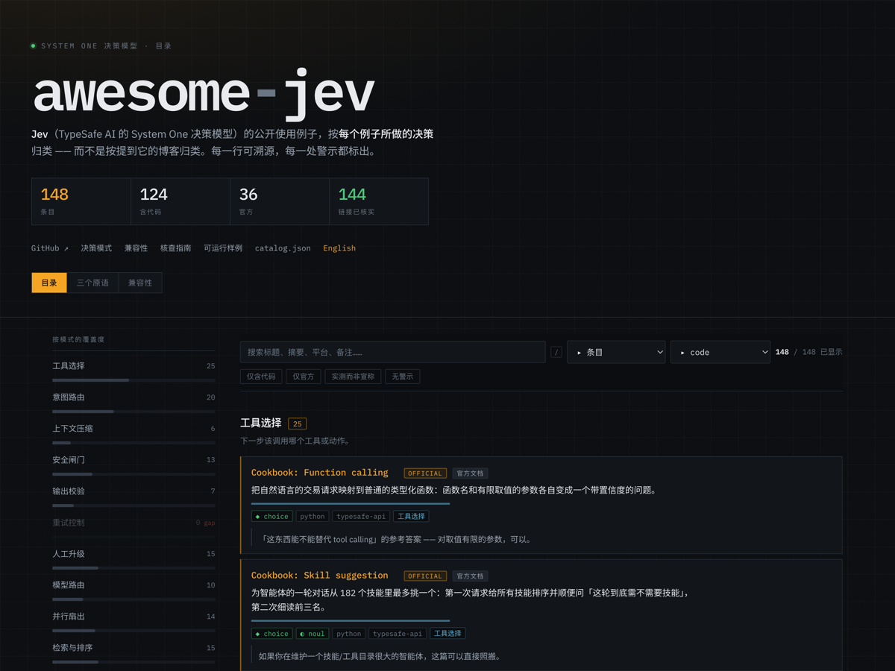
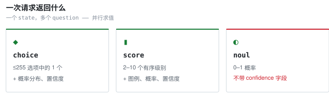
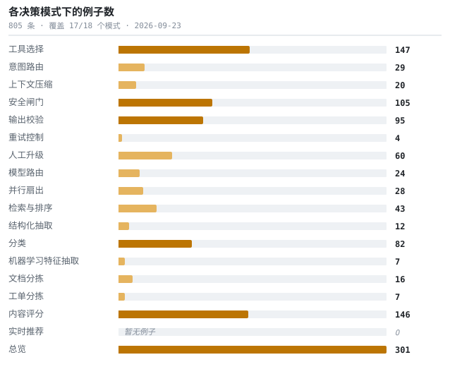

<!--
  本文件由 catalog.json 生成。请修改目录数据后运行 `python3 scripts/build_readme.py`。
-->

# awesome-jev

**全网 Jev（TypeSafe AI 的 System One 决策模型）使用例子索引 —— 按它做的**决策**归类，而不是按提到它的博客归类。**

      

[可搜索站点](https://kydlikebtc.github.io/awesome-jev/) &nbsp;·&nbsp; [English](README.md) &nbsp;·&nbsp; [决策模式](docs/patterns.md) &nbsp;·&nbsp; [兼容性](docs/compatibility.md) &nbsp;·&nbsp; [核查指南](docs/vetting.md)

点击条形即可筛选。另有两个视图：<a href="https://kydlikebtc.github.io/awesome-jev/?view=prims&lang=zh">三个原语</a> · <a href="https://kydlikebtc.github.io/awesome-jev/?view=compat&lang=zh">兼容性矩阵</a>。每个筛选条件和每个条目都是可分享的 URL。

---

## 这是什么

- **Jev** 是 TypeSafe AI 的决策模型。它不生成文本 —— 你给它状态和类型化问题，它返回带校准置信度的类型化答案，快且便宜到可以放进智能体的内层循环。
- **本仓库**收集它的公开使用例子，按所做的**决策**组织。你这周读的那篇资料是一次性的，决策模式不是。
- **凭什么可信：**每一行都写明来源、写明代码实际调用了哪些原语、并标出点开前该知道的事。Jev 的列表有几十个 —— 这一个竞争的是核实严谨度，不是收录数量。

> ⚠️ 不是产品本身，不是 SDK，与 TypeSafe AI 无隶属关系，也不构成推荐。收录只意味着链接可访问、并且有人读过 —— 仅此而已。详见[哪些经过核实](#哪些经过核实哪些没有)。

## Jev 返回什么

三个原语。下面所有模式都由它们构成，而最后一行那个不对称是最常见的 bug 来源。

<picture>
  <source media="(prefers-color-scheme: dark)" srcset="docs/assets/primitives-zh-dark.svg">
  
</picture>

输入**仅支持文本** —— 字符串、JSON 对象、或文本数组。上下文每次请求 **64k** token，其中 state 加最长的那个问题占 **32k**。输出 token 免费。权重未公开，因此无法本地运行。跨平台差异全表见 [`docs/compatibility.md`](docs/compatibility.md)。

## 从这里开始

六条，按阅读顺序。手工挑选 —— 因为「star 最多」和「该先读哪个」不是一回事。

1. **[Quickstart](https://docs.typesafe.ai/introduction/quickstart)**
   官方第一课：一条工单，一次请求里同时问一个 Choice、一个 Score 和一个 Noul，给了 Python / JS / cURL 三种写法。

2. **[Jev 1.13 known limitations](https://docs.typesafe.ai/model-jaggedness/jev-1.13)**
   官方文档里最有用、却最少被引用的一页。它还解释了一件事：对选项做一个 Choice，和每个选项各问一个 Noul，问的根本不是同一个问题。

3. **[Example: three primitives in one request](https://github.com/kydlikebtc/awesome-jev/blob/main/examples/01-three-primitives/main.py)**
   按官方 API 参考编写并逐字段对照核实，但未针对线上 API 实际执行过。

4. **[fast-jev-compaction](https://github.com/tamaratran/fast-jev-compaction)**
   每次工具调用恰好两个 noul：知道这次调用发生过是否还有意义、以及是否还需要完整原文输出。尽管它自己的描述里用了「打分」，实际并未使用 score 原语。

5. **[ai-cookbook: Jev track](https://github.com/daveebbelaar/ai-cookbook)**
   找到的最好的结构化教程。它明确指出类型化输出不保证决策正确、列出了官方记录的弱项，并且对自己给出的成本示例做了限定而不是拿来营销。

6. **[Hermes Agent: Jev compaction evaluation](https://github.com/NousResearch/hermes-agent)**
   本目录可信度最高的一条。召回率低于他们现有的摘要器，在相同上下文预算下与「按时间倒序」打平。成本确实低得多。在一个被热炒的模型上公开负面结果，非常少见。

## 覆盖度

全部决策模式，按例子数量排列长度。这张表同时就是索引 —— 名称链接到下面对应章节。数字为 0 的是待补的研究缺口，不是渲染 bug。

<picture>
  <source media="(prefers-color-scheme: dark)" srcset="docs/assets/coverage-zh-dark.svg">
  
</picture>

有两个模式目前没有例子。两者都是合理的适用场景，只是还没人公开发表 —— 见 [`docs/status.md`](docs/status.md)。

## 实测，而非宣称

关于这个模型流传的性能数字几乎全是厂商自测，而且参考答案由其他模型的判断推导而来、不是人工 ground truth。下面这些是本目录里的独立实测 —— 其中几条是**负面结果**，这恰恰是它们值得先读的原因。

- **[Hermes Agent: Jev compaction evaluation](https://github.com/NousResearch/hermes-agent)** — 把 Jev 压缩方案移植过来，与自家在用的摘要器对比实测，最后公开结论：不采用。
  `基准测试` · ★247,881 · `Py` · `noul`
  本目录可信度最高的一条。召回率低于他们现有的摘要器，在相同上下文预算下与「按时间倒序」打平。成本确实低得多。在一个被热炒的模型上公开负面结果，非常少见。

- **[worldmonitor: news threat classification](https://github.com/koala73/worldmonitor)** — 用两个 Choice 判断威胁等级与类别；盲测发现 Jev 只是与原有模型打平，于是一直保持影子运行。
  `基准测试` · ★87,191 · `TS` · `choice` · ⚠ `仅影子运行`
  接进去了但故意不生效：按他们自己的说法，Jev 返回的任何东西都不会进入标签、缓存行或告警。带黄金测试集。想在不拿生产环境下注的前提下试新模型，这是值得照抄的做法。

- **[no-mistakes: review context selection](https://github.com/kunchenguid/no-mistakes)** — 对每个候选文件打一个 Score 来挑选审查上下文；实测结果是：计费输入明显增加，而实际耗时几乎没改善。
  `基准测试` · ★8,598 · `Go` · `score`
  他们自己的建议是：这个功能保持可选、默认关闭、不要宣传省钱。诚实的实测就该长这样。

- **[Probing Jev's behaviour with repeated API calls](https://github.com/ahastudio/til)** — 独立的韩语实测笔记，报告仅仅把选项顺序倒过来，就能让概率移动到足以翻转 0.9 阈值的程度。
  `基准测试` · ★190 · `Py` · ⚠ `无许可证` `宣称未核实`
  在所有资料里找到的最具操作价值的工程警示：如果仅仅选项顺序就能把概率推过你的阈值，那你的阈值没有看上去那么稳。这是独立且未被复现的结果，具体幅度请当作指示性数据。

- **[typesafe-ai-benchmark](https://github.com/iammrduncan/typesafe-ai-benchmark)** — 一个模仿其结构化输出形状的网关，用于与之对比测试。
  `基准测试` · ★37 · iammrduncan · `TS`

- **[jev-rerank-bench](https://github.com/anessbelbati/jev-rerank-bench)** — 与专用重排模型在 14 个数据集上的独立横评。
  `基准测试` · ★5 · anessbelbati · `Py`
  这是独立实测而非厂商数字，而且直接对比了专门做重排的模型 —— 这正是 search-ranking 模式该看的对比。

- **[An early-access test of TypeSafe's Jev: calibrated judgments for half a cent](https://lindfors.no/blog/a-first-look-at-typesafes-jev/)** — 找到的最好的独立实测：固定单一模型版本、24 份挪威语文档，开篇就展示了一个模型答错、但同时正确报出低置信度的案例。
  `基准测试` · Lindfors
  方法论交代干净，并诚实限定为「单日快照」。开篇就摆失败案例，这才让它成为真正的校准检验，而不是一篇软文。

- **[Testing TypeSafe Jev, Mistral and Gemini for local event validation](https://nearhere.events/blog/typesafe-jev-mistral-gemini-event-validation)** — 找到的唯一三方横评，每个模型分别调过提示词，且明确把范围限定在单一任务上、不做通用排名。
  `基准测试` · Near Here
  自我限定很规范：这是用例研究，不是模型排行榜。这种克制比数字本身更少见。

## 按决策模式

主索引。每个标题是智能体必须做的一个决策；下面的行是做这个决策的例子。警示以短标记呈现 —— 每行的完整备注在 [`catalog.json`](catalog.json) 和[站点](https://kydlikebtc.github.io/awesome-jev/)里。

### 工具选择

_智能体下一步该调用哪个工具或动作。_

- **[Cookbook: Function calling](https://docs.typesafe.ai/cookbooks/function_calling)** ⭐ — 把自然语言的交易请求映射到普通的类型化函数：函数名和有限取值的参数各自变成一个带置信度的问题。
  `官方文档` · `Py` · `choice`

- **[Cookbook: Skill suggestion](https://docs.typesafe.ai/cookbooks/skill_suggestion)** ⭐ — 为智能体的一轮对话从 182 个技能里最多挑一个：第一次请求给所有技能排序并顺便问「这轮到底需不需要技能」，第二次细读前三名。
  `官方文档` · `Py` · `choice` · `noul`

- **[Demo: Smart home assistant](https://docs.typesafe.ai/demos/smart-home)** ⭐ — 一个可运行的智能家居助手示例，用类型化决策来解析用户请求。
  `官方文档` · `Py`

- **[claude-code-templates: three Jev plugins](https://github.com/davila7/claude-code-templates)** — 三个可独立安装的 Claude Code 插件 —— 护栏、模型路由、技能推荐 —— 各自带 hook 和测试。
  `插件` · ★30,899 · `Py` · `TS` · `choice` · `score` · `noul`

- **[Composio TypeSafe provider](https://github.com/ComposioHQ/composio/tree/next/python/providers/typesafe)** — 把工具目录编译成问题，再从答案还原出 tool call，并为「弃权」和「需确认」两种情况定义了专门的错误类型。
  `开源项目` · ★30,279 · `Py` · `choice`

- **[FastMCP jev_search transform](https://github.com/PrefectHQ/fastmcp/blob/main/fastmcp_slim/fastmcp/experimental/transforms/jev_search.py)** — 两段式 MCP 工具检索：先用一个宽 Choice 对整个目录粗排，再给候选短名单配完整描述，每个候选各配一个 Noul 判断它到底是否胜任。
  `开源项目` · ★27,855 · `Py` · `choice` · `noul`

- **[Cua driver: jev-use example](https://github.com/trycua/cua/tree/main/libs/cua-driver/examples/jev-use)** — Python 与 TypeScript 双实现的 computer-use 动作选择：Jev 从不可变候选集里挑下一个浏览器动作，保留 reobserve 和 abstain 两个特殊选项。
  `开源项目` · ★25,834 · `Py` · `TS` · `choice`

- **[json-render](https://github.com/vercel-labs/json-render)** — Vercel Labs 的生成式 UI 框架。实验里 Jev 不逐 token 写 JSON，只负责选组件、属性和布局。
  `开源项目` · ★17,994 · Vercel Labs · `TS` · `choice`

- **[jev-ultrafast](https://github.com/browser-use/jev-ultrafast)** — Browser Use 做的高速浏览器 Agent。Jev 每一步只判断「做什么、点哪个元素」，要打字才叫小模型。
  `开源项目` · ★16,758 · Browser Use · `Py` · `choice` · ⚠ `厂商自报`

- **[DeepChat: agent tool-permission review](https://github.com/ThinkInAIXYZ/deepchat)** — 从三个维度审查每次工具调用：风险等级、用户是否授权、以及一个显式的提示注入压力检查。
  `开源项目` · ★6,338 · `TS` · `choice` · `noul`

- **[jev-trader](https://github.com/jarrodwatts/jev-trader)** — 在 Monad 测试网上做高频做市。Jev 根据价差和成交方向判断下一步买还是卖。
  `开源项目` · ★1,911 · `TS` · `choice` · ⚠ `宣称未核实`

- **[agent-desktop](https://github.com/lahfir/agent-desktop)** — 桌面自动化。读系统无障碍树，判断下一步该点哪个按钮、菜单或输入框。
  `开源项目` · ★1,449 · `Rs` · `choice`

- **[typesafe-computer-use](https://github.com/awlevin/typesafe-computer-use)** — macOS 上的 computer use：OCR 屏幕、分类下一步动作、点击。每步成本不到一分钱的零头。
  `开源项目` · ★775 · awlevin · `Py`

- **[Jev-cu](https://github.com/Sac-Y/Jev-cu)** — 一个 computer-use 智能体：判断该对无障碍树里哪个元素操作，并单独用一个 noul 判断这个动作是否需要用户显式确认。
  `开源项目` · ★557 · `JS` · `choice` · `noul`

- **[foreman](https://github.com/thruwire/foreman)** — 一个「软件工厂工头」，用 Jev 决定智能体流水线下一步该做什么。
  `开源项目` · ★482 · thruwire · `Py`

- **[hermes-jev-skills](https://github.com/kerpopule/hermes-jev-skills)** — 九个 agent 技能加一个 CLI，覆盖模型路由、记忆过滤、对话轮保留、多选一技能选择和下一步动作决策。
  `插件` · ★408 · `Py` · `choice` · `score` · `noul`

- **[jev-browser-use](https://github.com/wy-coliney/jev-browser-use)** — 把循环拆开：Jev 负责点击，推理模型负责思考与验证。
  `开源项目` · ★341 · wy-coliney · `JS`

- **[typesafe-mario](https://github.com/fhshaik/typesafe-mario)** — 让 Jev 玩《超级马里奥》。不看截图，直接读模拟器 RAM 里的结构化状态，再决定跑、跳、躲。
  `开源项目` · ★340 · `Py` · `choice` · `score` · `noul` · ⚠ `代码未实测` `仅一次提交` `无许可证`

- **[mobile-jev](https://github.com/droidrun/mobile-jev)** — 移动端 computer use：由 Jev 决定手机屏幕上的下一个动作。
  `开源项目` · ★336 · droidrun · `JS`

- **[jev-browser](https://github.com/jkudish/jev-browser)** — 浏览器自动化，下一步动作由 Jev 选择。
  `开源项目` · ★235 · jkudish · `TS`

- **[jev-voice-browser](https://github.com/moritzkremb/jev-voice-browser)** — 语音驱动的浏览器控制：目标选项每次请求都按当前实时元素列表重建，并且总是包含一个 none 选项。
  `开源项目` · ★222 · `JS` · `choice` · `score` · `noul`

- **[hyperedit](https://github.com/kevinbadi/hyperedit)** — 一个 AI 视频编辑器：把编辑指令路由到具体操作、目标片段和轨道，并以关键词路由作为兜底。
  `开源项目` · ★179 · `TS` · `choice` · `noul` · ⚠ `无许可证`

- **[jevpilot](https://github.com/standardagents/jevpilot)** — 驾驶模拟器的自动驾驶，每个 tick 问两个 choice；只剩单一选项的问题直接在本地短路，不花钱发出去。
  `开源项目` · ★162 · `JS` · `choice` · ⚠ `无许可证`

- **[jevrouter](https://github.com/BillionsBobby/JevRouter)** — 面向模型、工具和子智能体的路由器。
  `开源项目` · ★151 · billionsbobby · `TS`

- **[pi-jev](https://github.com/y0usaf/pi-jev)** — 给编程智能体做的决策层：一个可度量的工具调用闸门，外加一个返回校准答案的类型化提问。
  `插件` · ★135 · y0usaf · `TS`

- **[jev-drone](https://github.com/RomanSlack/jev-drone)** — 拿 Jev 控无人机。底层飞控继续负责稳定和安全，Jev 只做爬升、刹车、穿越障碍这类上层判断。
  `开源项目` · ★121 · `Py` · `choice` · `score` · `noul` · ⚠ `宣称未核实`

- **[skillranker](https://github.com/Dicklesworthstone/skillranker)** — 用当前会话上下文给智能体的技能排序以决定下一步，带 Claude Code hook。
  `插件` · ★110 · dicklesworthstone · `Rs` · ⚠ `无许可证`

- **[jev-chat: a tool-calling chatbot with no LLM](https://github.com/w3cj/jev-chat)** — 一个完全不含语言模型的 tool calling 聊天机器人：一次请求同时问清请求类型、该调哪个工具、以及每个工具的参数。
  `开源项目` · ★86 · `TS` · `choice` · `noul`

- **[neo4jev](https://github.com/jexp/neo4jev)** — 把 Jev 塞进知识图谱。每走到一个节点，判断下一条最值得走的边，再一路找下去。
  `开源项目` · ★83 · `Py` · `choice`

- **[tsai-sc](https://github.com/phyous/tsai-sc)** — 通过键鼠操作一款 90 年代即时战略游戏，并记录每次动作的概率。
  `开源项目` · ★22 · phyous · `Py`

- **[OneVOneJev](https://github.com/emrickgarrett/OneVOneJev)** — 浏览器里的 1v1 FPS。每个决策 tick 都要判断走位、视角、瞄准、开火和跳跃。
  `开源项目` · ★20 · `TS` · `choice` · ⚠ `代码未实测` `无许可证`

- **[jev-use](https://github.com/shitianfang/jev-use)** — 一个智能体插件：把不需要文本输出的步骤交给 Jev，而不是主模型。
  `插件` · ★15 · shitianfang · `JS`

- **[Example: speculative fan-out](https://github.com/kydlikebtc/awesome-jev/blob/main/examples/03-fan-out/main.py)** — 一次问清操作本身、以及每个可能操作各自的目标 —— 于是浏览器的一步永远不需要第二次往返。
  `代码片段` · `Py` · `choice` · `noul` · ⚠ `代码未实测`

- **[Example: tool selection with a none option](https://github.com/kydlikebtc/awesome-jev/blob/main/examples/04-tool-selection/main.py)** — 把「选哪个工具」的 choice 和「到底需不需要工具」的 noul 配对使用 —— 因为这是两个不同的问题。
  `代码片段` · `Py` · `choice` · `noul` · ⚠ `代码未实测`

- **[Jev (Fully Tested) + Browser Use: FASTEST AI Agent I'VE TRIED YET!](https://www.youtube.com/watch?v=SNJ3yuJ_QwY)** — 把 Jev 接到 Browser Use 上，驱动一个浏览器自动化智能体。
  `视频` · AICodeKing · ⚠ `宣称未核实`

### 意图路由

_判断用户意图，把请求分流到正确的分支。_

- **[Demo: Smart home assistant](https://docs.typesafe.ai/demos/smart-home)** ⭐ — 一个可运行的智能家居助手示例，用类型化决策来解析用户请求。
  `官方文档` · `Py`

- **[Pattern: Confidence-gated routing](https://docs.typesafe.ai/patterns/confidence-routing)** ⭐ — 把 confidence 当作第二个维度：答案告诉你「是什么」，置信度告诉你「该不该照它执行」。
  `官方文档` · `Py`

- **[Pattern: Intent routing](https://docs.typesafe.ai/patterns/intent-routing)** ⭐ — 对进来的请求做分类，路由到足够用的最便宜那个处理方：确定性代码、专用 LLM、或人。
  `官方文档` · `Py` · `choice`

- **[AutoGPT TypeSafe blocks](https://github.com/Significant-Gravitas/AutoGPT/tree/master/autogpt_platform/backend/backend/blocks/typesafe)** — 七个生产级 block（choice/score/yes-no/ask-many/route/pick-best/filter），带 UTF-8 字节预算、逐字报文留存和十一个测试文件。
  `开源项目` · ★187,482 · `Py` · `choice` · `score` · `noul`

- **[Airflow LLMBranchOperator with Jev](https://airflow.apache.org/docs/apache-airflow-providers-common-ai/stable/index.html)** — 把下游任务 id 变成 choice 的选项集，并用最小置信度闸门把不确定的运行转给人处理。
  `平台集成` · ★46,934 · `Py` · `choice`

- **[Inbox Zero: seven email decisions](https://github.com/elie222/inbox-zero)** — 七个互不相同的邮件决策，每个都有自己单独设定的阈值，任何出错都回落到普通 LLM。
  `开源项目` · ★12,278 · `TS` · `choice` · `noul`

- **[Real Python: hello-jev](https://github.com/realpython/materials/tree/master/hello-jev)** — 带对照组的教学示例：同一个问询台任务，一份是只认 Y/N 的纯 Python 写法，旁边是一个能读出意图的 Noul。
  `教程` · ★5,205 · Real Python · `Py` · `noul`

- **[ai-cookbook: Jev track](https://github.com/daveebbelaar/ai-cookbook)** — 一套循序渐进的课程：从第一次调用、逐个原语、state 形状与 criteria，一直到工单分拣和多步工作流，并对应了全部四个官方模式。
  `教程` · ★4,559 · `Py` · `choice` · `score` · `noul`

- **[jev-chat-jarvis](https://github.com/jev-chat/jev-chat-jarvis)** — 一个 Android 回复副驾：从屏幕文本判断意图、时机和风险，OCR 与文案起草交给另外的模型。
  `开源项目` · ★1,950 · `Java` · `choice` · `score` · `noul`

- **[foreman](https://github.com/thruwire/foreman)** — 一个「软件工厂工头」，用 Jev 决定智能体流水线下一步该做什么。
  `开源项目` · ★482 · thruwire · `Py`

- **[jev-search](https://github.com/superagents-lab/jev-search)** — Jev 驱动的网页搜索：先选时间窗口和最佳查询改写，再分批对结果逐条用 noul 重排。
  `开源项目` · ★390 · `TS` · `choice` · `noul`

- **[jev-voice-browser](https://github.com/moritzkremb/jev-voice-browser)** — 语音驱动的浏览器控制：目标选项每次请求都按当前实时元素列表重建，并且总是包含一个 none 选项。
  `开源项目` · ★222 · `JS` · `choice` · `score` · `noul`

- **[hyperedit](https://github.com/kevinbadi/hyperedit)** — 一个 AI 视频编辑器：把编辑指令路由到具体操作、目标片段和轨道，并以关键词路由作为兜底。
  `开源项目` · ★179 · `TS` · `choice` · `noul` · ⚠ `无许可证`

- **[jev-chat: a tool-calling chatbot with no LLM](https://github.com/w3cj/jev-chat)** — 一个完全不含语言模型的 tool calling 聊天机器人：一次请求同时问清请求类型、该调哪个工具、以及每个工具的参数。
  `开源项目` · ★86 · `TS` · `choice` · `noul`

- **[jev-social](https://github.com/socai-io/jev-social)** — 社交平台调研，带类型化路由和浏览器取证。
  `开源项目` · ★46 · socai-io · `JS`

- **[ha-jev](https://github.com/AboveColin/HA-Jev)** — 一个 Home Assistant 集成：把类型化答案变成传感器，并提供可用于自动化的动作。
  `平台集成` · ★45 · abovecolin · `Py`

- **[hono-jev-router](https://github.com/yusukebe/hono-jev-router)** — 按语义路由 HTTP 请求 —— 给 Web 框架做的语义路由器。
  `开源项目` · ★45 · yusukebe · `TS`

- **[A deep dive into Jev, TypeSafe's System One model](https://flaviocopes.com/jev/)** — 技术密度最高的独立讲解：JS / Python / AI SDK 三种代码、三种应答结构、进阶模式，还诚实列出了模型的失效场景。
  `教程` · Flavio Copes · `JS` · `Py` · `TS` · `choice` · `score` · `noul`

- **[Example: confidence-gated escalation](https://github.com/kydlikebtc/awesome-jev/blob/main/examples/02-confidence-gate/main.py)** — 带「自动执行或转人工」闸门的路由；策略函数刻意留空 —— 阈值该定在哪，是你的决定。
  `代码片段` · `Py` · `choice` · ⚠ `代码未实测`

- **[Jev AI Use Cases](https://medium.com/data-science-in-your-pocket/jev-ai-use-cases-9a87d57ac3b4)** — 逐个用例走一遍 —— 智能体路由、智能体内部的决策层、工单分拣 —— 每个都给出具体的选项集和示例响应。
  `教程` · Mehul Gupta · `Py` · `choice` · ⚠ `付费墙`

- **[Jev on Netlify AI Gateway](https://www.netlify.com/changelog/typesafe-jev-ai-gateway/)** — 在 Netlify function 里零配置调用：直接用官方 SDK，不需要 API key、baseURL 或 provider 配置，按 Netlify credits 计费。
  `平台集成` · `TS` · `choice`

- **[langchain-typesafe](https://docs.langchain.com/oss/python/integrations/providers/typesafe)** — LangChain 集成：一个分类器，外加用于模型路由、以及在高风险工具调用执行前拦截它的实验性 middleware。
  `平台集成` · `Py` · `choice` · `score` · `noul` · ⚠ `需早期访问`

- **[Using TypeSafe Jev with the AI SDK](https://vercel.com/kb/guide/typesafe-jev-and-ai-sdk)** — Vercel 最完整的实操指南：单问题与多问题调用、按概率阈值路由，以及用 mock evaluation 模型写单元测试。
  `教程` · `TS` · `noul` · `choice` · `score`

- **[jevai.org community showcase cases](https://www.jevai.org/cases)** — 九个社区演练场景：意图路由、发票分类、新闻过滤、商品打标、内容审核、主张核验、CSV 校验等。
  `开源项目` · ⚠ `宣称未核实`

### 上下文压缩

_判断哪些工具调用和结果仍然相关，从而丢弃过期上下文。_

- **[Hermes Agent: Jev compaction evaluation](https://github.com/NousResearch/hermes-agent)** — 把 Jev 压缩方案移植过来，与自家在用的摘要器对比实测，最后公开结论：不采用。
  `基准测试` · ★247,881 · `Py` · `noul`

- **[jcode: memory recall without embeddings](https://github.com/1jehuang/jcode)** — 把记忆召回的整套检索栈替换掉 —— 不用 embedding、不用 BM25、不用重排器 —— 改为对每条候选记忆批量问一个 Noul。
  `开源项目` · ★19,996 · `Rs` · `noul`

- **[fast-jev-compaction](https://github.com/tamaratran/fast-jev-compaction)** — 一个 Claude Code 插件，用逐条决策取代压缩式摘要：过期的工具调用被丢弃或截断，保留下来的全部逐字不变。
  `插件` · ★6,090 · tamaratran · `TS` · `noul`

- **[hermes-jev-skills](https://github.com/kerpopule/hermes-jev-skills)** — 九个 agent 技能加一个 CLI，覆盖模型路由、记忆过滤、对话轮保留、多选一技能选择和下一步动作决策。
  `插件` · ★408 · `Py` · `choice` · `score` · `noul`

- **[jev-pruner](https://github.com/tamaratran/jev-pruner)** — 在模型看到之前先修剪冗长的 shell 输出，每个片段问一个 Noul。
  `插件` · ★137 · tamaratran · `TS` · `noul`

- **[Winnow](https://github.com/GhalebDweikat/winnow)** — 给 Claude Code 做上下文垃圾回收。Read / Bash / Grep 吐一大堆时，Jev 先判断哪些真和当前任务有关。
  `插件` · ★59 · `Py` · `noul`

### 安全闸门

_在执行前判断一个动作是否安全。属纵深防御，绝不是安全边界。_

- **[Cookbook: Classifying RAG passages](https://docs.typesafe.ai/cookbooks/classifying_rag_passages)** ⭐ — 给每条召回的段落打分，再由代码决定哪些能进入回答模型 —— 矛盾的标记保留，夹带提示注入的直接丢弃。
  `官方文档` · `Py`

- **[Cookbook: Guardrails for LLMs](https://docs.typesafe.ai/cookbooks/llm_guardrails)** ⭐ — 用一次请求筛查 LLM 应用的每一条进出消息，既点明风险类型、又给「照做会造成多大危害」打分。
  `官方文档` · `Py` · `noul` · `score`

- **[sub2api: Jev as a moderation endpoint](https://github.com/Wei-Shaw/sub2api)** — 作为审核 API 的直接替代：一次请求并行问多个 Noul，每个危害类别一个，且每条指令都带反注入前缀。
  `开源项目` · ★42,345 · `Go` · `noul`

- **[claude-code-templates: three Jev plugins](https://github.com/davila7/claude-code-templates)** — 三个可独立安装的 Claude Code 插件 —— 护栏、模型路由、技能推荐 —— 各自带 hook 和测试。
  `插件` · ★30,899 · `Py` · `TS` · `choice` · `score` · `noul`

- **[@langchain/typesafe](https://github.com/langchain-ai/langchainjs)** — LangChain 集成的 JavaScript 对应版本，分类器与 middleware 形状一致。
  `平台集成` · ★18,214 · `TS` · `choice` · `score` · `noul`

- **[DeepChat: agent tool-permission review](https://github.com/ThinkInAIXYZ/deepchat)** — 从三个维度审查每次工具调用：风险等级、用户是否授权、以及一个显式的提示注入压力检查。
  `开源项目` · ★6,338 · `TS` · `choice` · `noul`

- **[agentgateway: CI-validated LLM guardrail](https://github.com/agentgateway/agentgateway)** — 三个共用同一严重度量表的 Score 问题，两项以上越线即拦截请求，并且失败时默认关闭。
  `开源项目` · ★4,971 · `Rs` · `score`

- **[Jev-cu](https://github.com/Sac-Y/Jev-cu)** — 一个 computer-use 智能体：判断该对无障碍树里哪个元素操作，并单独用一个 noul 判断这个动作是否需要用户显式确认。
  `开源项目` · ★557 · `JS` · `choice` · `noul`

- **[jev-mcp](https://github.com/jkudish/jev-mcp)** — 现成的 Agent 判断工具箱：事实核验、内容筛查、语义排序、分类和信息提取，各自独立成工具。
  `插件` · ★253 · `JS` · `choice` · `score` · `noul`

- **[pi-jev](https://github.com/y0usaf/pi-jev)** — 给编程智能体做的决策层：一个可度量的工具调用闸门，外加一个返回校准答案的类型化提问。
  `插件` · ★135 · y0usaf · `TS`

- **[jev-drone](https://github.com/RomanSlack/jev-drone)** — 拿 Jev 控无人机。底层飞控继续负责稳定和安全，Jev 只做爬升、刹车、穿越障碍这类上层判断。
  `开源项目` · ★121 · `Py` · `choice` · `score` · `noul` · ⚠ `宣称未核实`

- **[Jev-Moderation-Bot](https://github.com/brainstormity/Jev-Moderation-Bot)** — 一个 Discord 审核机器人：用 Choice 给每条消息定级、用 Noul 表示封禁紧急度，管理员一旦赦免，该消息会作为「安全先例」注入后续请求。
  `开源项目` · ★41 · brainstormity · `Py` · `choice` · `noul`

- **[Building a Harness with Jev](https://www.langchain.com/blog/building-a-harness-with-jev)** — LangChain 的讲解兼集成实操：三种问题类型，加上模型路由、以及在高风险工具调用执行前拦截它。
  `文章` · Sydney Runkle, Hunter Lovell · `Py` · ⚠ `厂商自报`

- **[langchain-typesafe](https://docs.langchain.com/oss/python/integrations/providers/typesafe)** — LangChain 集成：一个分类器，外加用于模型路由、以及在高风险工具调用执行前拦截它的实验性 middleware。
  `平台集成` · `Py` · `choice` · `score` · `noul` · ⚠ `需早期访问`

### 输出校验

_在输出到达用户前，按评分标准检查模型产出。_

- **[Cookbook: Double-checking citations](https://docs.typesafe.ai/cookbooks/citation_check)** ⭐ — 用一个 Choice 对着原文核查引用是否错误或凭空编造，并用它的置信度把边缘情况标出来送审。
  `官方文档` · `Py` · `choice`

- **[Cookbook: Guardrails for LLMs](https://docs.typesafe.ai/cookbooks/llm_guardrails)** ⭐ — 用一次请求筛查 LLM 应用的每一条进出消息，既点明风险类型、又给「照做会造成多大危害」打分。
  `官方文档` · `Py` · `noul` · `score`

- **[jev-mcp](https://github.com/jkudish/jev-mcp)** — 现成的 Agent 判断工具箱：事实核验、内容筛查、语义排序、分类和信息提取，各自独立成工具。
  `插件` · ★253 · `JS` · `choice` · `score` · `noul`

- **[jev-review](https://github.com/NiazMorshed2007/jev-review)** — 一个本地优先的 MCP 插件，供编程智能体做持续的代码质量审查。
  `插件` · ★198 · niazmorshed2007 · `TS`

- **[perch: semantic code linting](https://github.com/lakeday-org/perch)** — 先用 tree-sitter 找出并排序方法，再把用户自写的 YAML 规则编译成 noul；严重度取评分量表的期望值，而不是概率最高的那一档。
  `开源项目` · ★168 · `JS` · `choice` · `score` · `noul`

- **[jev-eval-agent](https://github.com/vinilana/jev-eval-agent)** — 一个把评测工作通过类型化决策来路由的智能体。
  `开源项目` · ★103 · vinilana · `TS` · ⚠ `无许可证`

- **[supercov](https://github.com/supercorp-ai/supercov)** — 给编程智能体用的代码质量与覆盖率判断，Rust 实现。
  `开源项目` · ★95 · supercorp-ai · `Rs`

- **[Canny](https://github.com/qkal/Canny)** — 防 Coding Agent 嘴硬说自己做完了。看工具输出、代码 diff 和测试结果，再判断完成声明靠不靠谱。
  `开源项目` · ★31 · `TS` · `noul` · `score`

- **[jev-commit](https://github.com/valentynkit/jev-commit)** — 一个 pre-commit 钩子：一次调用判断提交信息与 diff 是否相符。
  `开源项目` · ★9 · valentynkit · `Py`

- **[Testing TypeSafe Jev, Mistral and Gemini for local event validation](https://nearhere.events/blog/typesafe-jev-mistral-gemini-event-validation)** — 找到的唯一三方横评，每个模型分别调过提示词，且明确把范围限定在单一任务上、不做通用排名。
  `基准测试` · Near Here

- **[TypeSafe's Jev: Can decision models replace LLM judges?](https://arize.com/blog/typesafe-jev-llm-judge/)** — 汇总了目前已有的第三方评测，并讨论决策模型能在多大程度上顶替 LLM 评判者。
  `文章` · Laurie Voss

### 人工升级

_用校准置信度决定哪些情况必须由人来看。_

- **[Cookbook: Classification using confidence](https://docs.typesafe.ai/cookbooks/classification_using_confidence)** ⭐ — 把年报分入 75 个行业组，再根据答案自身的置信度决定：报这个细分组，还是退回上一层的大类。
  `官方文档` · `Py` · `choice`

- **[Cookbook: Double-checking citations](https://docs.typesafe.ai/cookbooks/citation_check)** ⭐ — 用一个 Choice 对着原文核查引用是否错误或凭空编造，并用它的置信度把边缘情况标出来送审。
  `官方文档` · `Py` · `choice`

- **[Cookbook: Knowledge graph entity alignment](https://docs.typesafe.ai/cookbooks/entity_alignment)** ⭐ — 判断两份商品目录间 450 个候选配对里哪些指的是同一个东西 —— 一个 Score 就够，它的三级正好对应三种可执行动作。
  `官方文档` · `Py` · `score`

- **[Cookbook: Self-consistency with choices](https://docs.typesafe.ai/cookbooks/consistency_choice_cookbook)** ⭐ — 在内容审核决策里显式加入「不确定」这个选项，并衡量标签一致率与自动处置比例之间的取舍。
  `官方文档` · `Py` · `choice`

- **[Cookbook: Self-consistency with nouls](https://docs.typesafe.ai/cookbooks/consistency_noul_cookbook)** ⭐ — 把不确定的概率转人工复核，同时保留底层的 noul 数值本身，而不是压成一个标签了事。
  `官方文档` · `Py` · `noul`

- **[Pattern: Confidence-gated routing](https://docs.typesafe.ai/patterns/confidence-routing)** ⭐ — 把 confidence 当作第二个维度：答案告诉你「是什么」，置信度告诉你「该不该照它执行」。
  `官方文档` · `Py`

- **[Confidence](https://docs.typesafe.ai/confidence)** ⭐ — confidence 如何从概率分布推导出来，以及为什么在一种问题类型上调好的阈值不能挪到另一种上用。
  `官方文档`

- **[Airflow LLMBranchOperator with Jev](https://airflow.apache.org/docs/apache-airflow-providers-common-ai/stable/index.html)** — 把下游任务 id 变成 choice 的选项集，并用最小置信度闸门把不确定的运行转给人处理。
  `平台集成` · ★46,934 · `Py` · `choice`

- **[Composio TypeSafe provider](https://github.com/ComposioHQ/composio/tree/next/python/providers/typesafe)** — 把工具目录编译成问题，再从答案还原出 tool call，并为「弃权」和「需确认」两种情况定义了专门的错误类型。
  `开源项目` · ★30,279 · `Py` · `choice`

- **[Inbox Zero: seven email decisions](https://github.com/elie222/inbox-zero)** — 七个互不相同的邮件决策，每个都有自己单独设定的阈值，任何出错都回落到普通 LLM。
  `开源项目` · ★12,278 · `TS` · `choice` · `noul`

- **[jev-review](https://github.com/devagrawal09/jev-review)** — 代码审查前先过一遍 Jev，把高风险改动挑出来，再交给更贵的大模型或人。带本地看板。
  `开源项目` · ★510 · `TS` · `choice` · `score` · `noul`

- **[jev-align](https://github.com/sutro-sh/jev-align)** — 从人类反馈出发，构建经过校准的决策函数。
  `开源项目` · ★271 · sutro-sh · `Py`

- **[Probing Jev's behaviour with repeated API calls](https://github.com/ahastudio/til)** — 独立的韩语实测笔记，报告仅仅把选项顺序倒过来，就能让概率移动到足以翻转 0.9 阈值的程度。
  `基准测试` · ★190 · `Py` · ⚠ `无许可证` `宣称未核实`

- **[Jev-Moderation-Bot](https://github.com/brainstormity/Jev-Moderation-Bot)** — 一个 Discord 审核机器人：用 Choice 给每条消息定级、用 Noul 表示封禁紧急度，管理员一旦赦免，该消息会作为「安全先例」注入后续请求。
  `开源项目` · ★41 · brainstormity · `Py` · `choice` · `noul`

- **[jevcal](https://github.com/abhixhek/jevcal)** — 对着一个 LLM 教师模型做校准、定阈值和漂移检查 —— 而不是靠猜。
  `开源项目` · ★10 · abhixhek · `Py`

- **[Example: confidence-gated escalation](https://github.com/kydlikebtc/awesome-jev/blob/main/examples/02-confidence-gate/main.py)** — 带「自动执行或转人工」闸门的路由；策略函数刻意留空 —— 阈值该定在哪，是你的决定。
  `代码片段` · `Py` · `choice` · ⚠ `代码未实测`

- **[An early-access test of TypeSafe's Jev: calibrated judgments for half a cent](https://lindfors.no/blog/a-first-look-at-typesafes-jev/)** — 找到的最好的独立实测：固定单一模型版本、24 份挪威语文档，开篇就展示了一个模型答错、但同时正确报出低置信度的案例。
  `基准测试` · Lindfors

### 模型路由

_选择由哪个下游模型或档位处理请求。_

- **[Cookbook: Structured data extraction cascade](https://docs.typesafe.ai/cookbooks/sde_cascade)** ⭐ — 「小模型 → 校验 → 推理模型」的两段级联，用一小部分成本拿到接近大推理模型的质量。
  `官方文档` · `Py`

- **[Pattern: Intent routing](https://docs.typesafe.ai/patterns/intent-routing)** ⭐ — 对进来的请求做分类，路由到足够用的最便宜那个处理方：确定性代码、专用 LLM、或人。
  `官方文档` · `Py` · `choice`

- **[claude-code-templates: three Jev plugins](https://github.com/davila7/claude-code-templates)** — 三个可独立安装的 Claude Code 插件 —— 护栏、模型路由、技能推荐 —— 各自带 hook 和测试。
  `插件` · ★30,899 · `Py` · `TS` · `choice` · `score` · `noul`

- **[@langchain/typesafe](https://github.com/langchain-ai/langchainjs)** — LangChain 集成的 JavaScript 对应版本，分类器与 middleware 形状一致。
  `平台集成` · ★18,214 · `TS` · `choice` · `score` · `noul`

- **[jev-review](https://github.com/devagrawal09/jev-review)** — 代码审查前先过一遍 Jev，把高风险改动挑出来，再交给更贵的大模型或人。带本地看板。
  `开源项目` · ★510 · `TS` · `choice` · `score` · `noul`

- **[hermes-jev-skills](https://github.com/kerpopule/hermes-jev-skills)** — 九个 agent 技能加一个 CLI，覆盖模型路由、记忆过滤、对话轮保留、多选一技能选择和下一步动作决策。
  `插件` · ★408 · `Py` · `choice` · `score` · `noul`

- **[jev-codex-router](https://github.com/0xNatoshi/jev-codex-router)** — 先让 Jev 判断这一轮编程任务有多难，再决定模型档位、推理深度和速度模式。
  `插件` · ★188 · `JS` · `choice` · `score`

- **[jevrouter](https://github.com/BillionsBobby/JevRouter)** — 面向模型、工具和子智能体的路由器。
  `开源项目` · ★151 · billionsbobby · `TS`

- **[jev-eval-agent](https://github.com/vinilana/jev-eval-agent)** — 一个把评测工作通过类型化决策来路由的智能体。
  `开源项目` · ★103 · vinilana · `TS` · ⚠ `无许可证`

- **[jev-use](https://github.com/shitianfang/jev-use)** — 一个智能体插件：把不需要文本输出的步骤交给 Jev，而不是主模型。
  `插件` · ★15 · shitianfang · `JS`

- **[Building a Harness with Jev](https://www.langchain.com/blog/building-a-harness-with-jev)** — LangChain 的讲解兼集成实操：三种问题类型，加上模型路由、以及在高风险工具调用执行前拦截它。
  `文章` · Sydney Runkle, Hunter Lovell · `Py` · ⚠ `厂商自报`

- **[Jev AI Use Cases](https://medium.com/data-science-in-your-pocket/jev-ai-use-cases-9a87d57ac3b4)** — 逐个用例走一遍 —— 智能体路由、智能体内部的决策层、工单分拣 —— 每个都给出具体的选项集和示例响应。
  `教程` · Mehul Gupta · `Py` · `choice` · ⚠ `付费墙`

- **[langchain-typesafe](https://docs.langchain.com/oss/python/integrations/providers/typesafe)** — LangChain 集成：一个分类器，外加用于模型路由、以及在高风险工具调用执行前拦截它的实验性 middleware。
  `平台集成` · `Py` · `choice` · `score` · `noul` · ⚠ `需早期访问`

### 并行扇出

_把大量问题（包括推测性的）打包进一次请求，再由代码挑出真正用得上的答案。_

- **[Cookbook: Parallel questions](https://docs.typesafe.ai/cookbooks/parallel_questions)** ⭐ — 对一篇长文提 13 个合规问题，证明全部打包进一次调用便宜得多、也快得多，而答案不变。
  `官方文档` · `Py`

- **[Pattern: Speculative fan-out](https://docs.typesafe.ai/patterns/fan-out)** ⭐ — 把大量问题（包括可能用不上的）打包进一次请求，之后再由代码决定哪些答案真的用得上。
  `官方文档` · `Py`

- **[Quickstart](https://docs.typesafe.ai/introduction/quickstart)** ⭐ — 官方第一课：一条工单，一次请求里同时问一个 Choice、一个 Score 和一个 Noul，给了 Python / JS / cURL 三种写法。
  `官方文档` · `Py` · `TS` · `sh` · `choice` · `score` · `noul`

- **[AutoGPT TypeSafe blocks](https://github.com/Significant-Gravitas/AutoGPT/tree/master/autogpt_platform/backend/backend/blocks/typesafe)** — 七个生产级 block（choice/score/yes-no/ask-many/route/pick-best/filter），带 UTF-8 字节预算、逐字报文留存和十一个测试文件。
  `开源项目` · ★187,482 · `Py` · `choice` · `score` · `noul`

- **[sub2api: Jev as a moderation endpoint](https://github.com/Wei-Shaw/sub2api)** — 作为审核 API 的直接替代：一次请求并行问多个 Noul，每个危害类别一个，且每条指令都带反注入前缀。
  `开源项目` · ★42,345 · `Go` · `noul`

- **[jev-ultrafast](https://github.com/browser-use/jev-ultrafast)** — Browser Use 做的高速浏览器 Agent。Jev 每一步只判断「做什么、点哪个元素」，要打字才叫小模型。
  `开源项目` · ★16,758 · Browser Use · `Py` · `choice` · ⚠ `厂商自报`

- **[ai-cookbook: Jev track](https://github.com/daveebbelaar/ai-cookbook)** — 一套循序渐进的课程：从第一次调用、逐个原语、state 形状与 criteria，一直到工单分拣和多步工作流，并对应了全部四个官方模式。
  `教程` · ★4,559 · `Py` · `choice` · `score` · `noul`

- **[jev-chat: a tool-calling chatbot with no LLM](https://github.com/w3cj/jev-chat)** — 一个完全不含语言模型的 tool calling 聊天机器人：一次请求同时问清请求类型、该调哪个工具、以及每个工具的参数。
  `开源项目` · ★86 · `TS` · `choice` · `noul`

- **[OneVOneJev](https://github.com/emrickgarrett/OneVOneJev)** — 浏览器里的 1v1 FPS。每个决策 tick 都要判断走位、视角、瞄准、开火和跳跃。
  `开源项目` · ★20 · `TS` · `choice` · ⚠ `代码未实测` `无许可证`

- **[A deep dive into Jev, TypeSafe's System One model](https://flaviocopes.com/jev/)** — 技术密度最高的独立讲解：JS / Python / AI SDK 三种代码、三种应答结构、进阶模式，还诚实列出了模型的失效场景。
  `教程` · Flavio Copes · `JS` · `Py` · `TS` · `choice` · `score` · `noul`

- **[Example: speculative fan-out](https://github.com/kydlikebtc/awesome-jev/blob/main/examples/03-fan-out/main.py)** — 一次问清操作本身、以及每个可能操作各自的目标 —— 于是浏览器的一步永远不需要第二次往返。
  `代码片段` · `Py` · `choice` · `noul` · ⚠ `代码未实测`

- **[Example: three primitives in one request](https://github.com/kydlikebtc/awesome-jev/blob/main/examples/01-three-primitives/main.py)** — 最小化的第一次调用：同时问一个 choice、一个 score 和一个 noul，并标注了容易踩的那几处不对称。
  `代码片段` · `Py` · `choice` · `score` · `noul` · ⚠ `代码未实测`

- **[Jev on Cloudflare Workers AI](https://developers.cloudflare.com/ai/models/typesafe/jev/)** — Workers AI binding 与 REST 示例：一次调用同时问 noul、choice、score，并给出含逐答案置信度的完整响应。
  `平台集成` · `TS` · `sh` · `noul` · `choice` · `score`

- **[Using TypeSafe Jev with the AI SDK](https://vercel.com/kb/guide/typesafe-jev-and-ai-sdk)** — Vercel 最完整的实操指南：单问题与多问题调用、按概率阈值路由，以及用 mock evaluation 模型写单元测试。
  `教程` · `TS` · `noul` · `choice` · `score`

### 检索与排序

_对来自廉价检索步骤的候选做打分或重排。_

- **[Cookbook: Classifying RAG passages](https://docs.typesafe.ai/cookbooks/classifying_rag_passages)** ⭐ — 给每条召回的段落打分，再由代码决定哪些能进入回答模型 —— 矛盾的标记保留，夹带提示注入的直接丢弃。
  `官方文档` · `Py`

- **[Cookbook: Line-by-line search](https://docs.typesafe.ai/cookbooks/semantic_find)** ⭐ — 对一份服务条款做语义检索：一次请求用 Choice 给 218 个行号打分，同时用 Noul 判断文档里到底有没有答案。
  `官方文档` · `Py` · `choice` · `noul`

- **[Cookbook: Re-ranking](https://docs.typesafe.ai/cookbooks/rerank_typesafe)** ⭐ — 对 40 个法律检索问题各取 30 条 BM25 候选，按「问题-候选」逐对提问重排，top-1 与 top-10 准确率均大幅提升。
  `官方文档` · `Py`

- **[AutoGPT TypeSafe blocks](https://github.com/Significant-Gravitas/AutoGPT/tree/master/autogpt_platform/backend/backend/blocks/typesafe)** — 七个生产级 block（choice/score/yes-no/ask-many/route/pick-best/filter），带 UTF-8 字节预算、逐字报文留存和十一个测试文件。
  `开源项目` · ★187,482 · `Py` · `choice` · `score` · `noul`

- **[OpenViking: retrieval reranking](https://github.com/volcengine/OpenViking)** — 单次批量请求里对每个候选文档问一个 Noul，直接把「是」的概率当相关性分数。
  `开源项目` · ★38,384 · `Py` · `noul`

- **[FastMCP jev_search transform](https://github.com/PrefectHQ/fastmcp/blob/main/fastmcp_slim/fastmcp/experimental/transforms/jev_search.py)** — 两段式 MCP 工具检索：先用一个宽 Choice 对整个目录粗排，再给候选短名单配完整描述，每个候选各配一个 Noul 判断它到底是否胜任。
  `开源项目` · ★27,855 · `Py` · `choice` · `noul`

- **[jcode: memory recall without embeddings](https://github.com/1jehuang/jcode)** — 把记忆召回的整套检索栈替换掉 —— 不用 embedding、不用 BM25、不用重排器 —— 改为对每条候选记忆批量问一个 Noul。
  `开源项目` · ★19,996 · `Rs` · `noul`

- **[LanceDB TypeSafeReranker](https://github.com/lancedb/lancedb/blob/main/python/python/lancedb/rerankers/typesafe.py)** — 向量数据库的重排器：对每条结果问一个 Noul，把「是」的概率当作绝对相关性分数 —— 可以跨查询比较。
  `开源项目` · ★11,496 · `Py` · `noul`

- **[no-mistakes: review context selection](https://github.com/kunchenguid/no-mistakes)** — 对每个候选文件打一个 Score 来挑选审查上下文；实测结果是：计费输入明显增加，而实际耗时几乎没改善。
  `基准测试` · ★8,598 · `Go` · `score`

- **[jev-chat-jarvis](https://github.com/jev-chat/jev-chat-jarvis)** — 一个 Android 回复副驾：从屏幕文本判断意图、时机和风险，OCR 与文案起草交给另外的模型。
  `开源项目` · ★1,950 · `Java` · `choice` · `score` · `noul`

- **[jev-search](https://github.com/superagents-lab/jev-search)** — Jev 驱动的网页搜索：先选时间窗口和最佳查询改写，再分批对结果逐条用 noul 重排。
  `开源项目` · ★390 · `TS` · `choice` · `noul`

- **[pg-jev](https://github.com/realZachi/pg-jev)** — 一个真正的 PostgreSQL 扩展，把三个原语暴露成 SQL 函数 —— 语义判断可以直接写进任意行类型的 WHERE 子句。
  `开源项目` · ★291 · `Py` · `sh` · `choice` · `score` · `noul`

- **[jev-mcp](https://github.com/jkudish/jev-mcp)** — 现成的 Agent 判断工具箱：事实核验、内容筛查、语义排序、分类和信息提取，各自独立成工具。
  `插件` · ★253 · `JS` · `choice` · `score` · `noul`

- **[skillranker](https://github.com/Dicklesworthstone/skillranker)** — 用当前会话上下文给智能体的技能排序以决定下一步，带 Claude Code hook。
  `插件` · ★110 · dicklesworthstone · `Rs` · ⚠ `无许可证`

- **[jev-shell-history](https://github.com/mrnugget/jev-shell-history)** — Fish 风格的 zsh 历史自动建议，由 Jev 排序而不是按时间。
  `开源项目` · ★96 · mrnugget · `TS` · ⚠ `无许可证`

- **[neo4jev](https://github.com/jexp/neo4jev)** — 把 Jev 塞进知识图谱。每走到一个节点，判断下一条最值得走的边，再一路找下去。
  `开源项目` · ★83 · `Py` · `choice`

- **[Blink](https://github.com/ellipsis-dev/blink)** — 把 Jev 当代码库导航器。每走到一层目录，就判断哪些文件和当前问题最相关，再继续往下找。
  `开源项目` · ★56 · `TS` · `choice` · ⚠ `无许可证`

- **[jev-social](https://github.com/socai-io/jev-social)** — 社交平台调研，带类型化路由和浏览器取证。
  `开源项目` · ★46 · socai-io · `JS`

- **[jev-rerank-bench](https://github.com/anessbelbati/jev-rerank-bench)** — 与专用重排模型在 14 个数据集上的独立横评。
  `基准测试` · ★5 · anessbelbati · `Py`

### 结构化抽取

_从杂乱文本中取出类型化字段 —— 靠在候选中选择，而不是生成。_

- **[Cookbook: Date extraction](https://docs.typesafe.ai/cookbooks/date_extraction_cookbook)** ⭐ — 抽取绝对与相对日期：先问文档里点明了哪些部分，再在代码里做解析与校验，并按置信度决定是否送审。
  `官方文档` · `Py`

- **[Cookbook: Pre-parsed value extraction](https://docs.typesafe.ai/cookbooks/pre_parsed_value_extraction_cookbook)** ⭐ — 先用正则找出候选的邮箱、电话、金额，再让模型挑出被问到的那一段，于是代码拿到的是逐字原值。
  `官方文档` · `Py` · `choice`

- **[Cookbook: Structure recovery](https://docs.typesafe.ai/cookbooks/autoformat)** ⭐ — 用两次请求把丢了格式的纯文本还原成 Markdown：一次把硬换行的段落重新接起来，一次给每个块分类。
  `官方文档` · `Py`

- **[Cookbook: Structured data extraction cascade](https://docs.typesafe.ai/cookbooks/sde_cascade)** ⭐ — 「小模型 → 校验 → 推理模型」的两段级联，用一小部分成本拿到接近大推理模型的质量。
  `官方文档` · `Py`

### 分类

_把条目归入分类体系，包括用概率遍历的深层层级。_

- **[Cookbook: Classification using confidence](https://docs.typesafe.ai/cookbooks/classification_using_confidence)** ⭐ — 把年报分入 75 个行业组，再根据答案自身的置信度决定：报这个细分组，还是退回上一层的大类。
  `官方文档` · `Py` · `choice`

- **[Cookbook: Hierarchical classification](https://docs.typesafe.ai/cookbooks/hierarchical_classification)** ⭐ — 用对 Choice 概率做并行 beam search 的方式，遍历专利、零售、生物医学、源码这几套很深的分类体系。
  `官方文档` · `Py` · `choice`

- **[Cookbook: Knowledge graph entity alignment](https://docs.typesafe.ai/cookbooks/entity_alignment)** ⭐ — 判断两份商品目录间 450 个候选配对里哪些指的是同一个东西 —— 一个 Score 就够，它的三级正好对应三种可执行动作。
  `官方文档` · `Py` · `score`

- **[Cookbook: Structure recovery](https://docs.typesafe.ai/cookbooks/autoformat)** ⭐ — 用两次请求把丢了格式的纯文本还原成 Markdown：一次把硬换行的段落重新接起来，一次给每个块分类。
  `官方文档` · `Py`

- **[worldmonitor: news threat classification](https://github.com/koala73/worldmonitor)** — 用两个 Choice 判断威胁等级与类别；盲测发现 Jev 只是与原有模型打平，于是一直保持影子运行。
  `基准测试` · ★87,191 · `TS` · `choice` · ⚠ `仅影子运行`

- **[json-render](https://github.com/vercel-labs/json-render)** — Vercel Labs 的生成式 UI 框架。实验里 Jev 不逐 token 写 JSON，只负责选组件、属性和布局。
  `开源项目` · ★17,994 · Vercel Labs · `TS` · `choice`

- **[Inbox Zero: seven email decisions](https://github.com/elie222/inbox-zero)** — 七个互不相同的邮件决策，每个都有自己单独设定的阈值，任何出错都回落到普通 LLM。
  `开源项目` · ★12,278 · `TS` · `choice` · `noul`

- **[pg-jev](https://github.com/realZachi/pg-jev)** — 一个真正的 PostgreSQL 扩展，把三个原语暴露成 SQL 函数 —— 语义判断可以直接写进任意行类型的 WHERE 子句。
  `开源项目` · ★291 · `Py` · `sh` · `choice` · `score` · `noul`

- **[jev-mcp](https://github.com/jkudish/jev-mcp)** — 现成的 Agent 判断工具箱：事实核验、内容筛查、语义排序、分类和信息提取，各自独立成工具。
  `插件` · ★253 · `JS` · `choice` · `score` · `noul`

- **[Probing Jev's behaviour with repeated API calls](https://github.com/ahastudio/til)** — 独立的韩语实测笔记，报告仅仅把选项顺序倒过来，就能让概率移动到足以翻转 0.9 阈值的程度。
  `基准测试` · ★190 · `Py` · ⚠ `无许可证` `宣称未核实`

- **[unclutter](https://github.com/kitze/unclutter)** — 一个浏览器扩展，用可复用的模板规则清除页面杂物。
  `开源项目` · ★181 · kitze · `TS`

- **[perch: semantic code linting](https://github.com/lakeday-org/perch)** — 先用 tree-sitter 找出并排序方法，再把用户自写的 YAML 规则编译成 noul；严重度取评分量表的期望值，而不是概率最高的那一档。
  `开源项目` · ★168 · `JS` · `choice` · `score` · `noul`

- **[Prism](https://github.com/irfndi/prism-liquidity-agent)** — 不直接让 Jev 下单。它判断 toxic flow、市场压力、均值回归之类的状态，再交给原来的策略。
  `开源项目` · ★71 · `TS` · `choice` · `score`

- **[typesafe-adblock](https://github.com/realZachi/typesafe-adblock)** — 一个 Chrome 扩展，逐个询问 DOM 元素是不是广告。
  `开源项目` · ★68 · realzachi · `JS`

- **[Blink](https://github.com/ellipsis-dev/blink)** — 把 Jev 当代码库导航器。每走到一层目录，就判断哪些文件和当前问题最相关，再继续往下找。
  `开源项目` · ★56 · `TS` · `choice` · ⚠ `无许可证`

- **[ha-jev](https://github.com/AboveColin/HA-Jev)** — 一个 Home Assistant 集成：把类型化答案变成传感器，并提供可用于自动化的动作。
  `平台集成` · ★45 · abovecolin · `Py`

- **[SemDecide](https://github.com/sharziki/semdecide)** — 把 Jev 做成命令行。Shell 里直接分类、打分、过滤，适合接爬虫、CI 和数据流水线。
  `插件` · ★31 · `Py` · `sh` · `choice` · `score` · `noul`

- **[jev-mcp](https://github.com/blakestone-x/jev-mcp)** — 一个 MCP server，把分类、打分、检查、匹配、筛选暴露给任意智能体。
  `插件` · ★18 · blakestone-x · `Py`

- **[jev-skip](https://github.com/valentynkit/jev-skip)** — 读字幕、在观看时判断，从而跳过视频里的赞助段落。
  `开源项目` · ★3 · valentynkit · `TS`

- **[An early-access test of TypeSafe's Jev: calibrated judgments for half a cent](https://lindfors.no/blog/a-first-look-at-typesafes-jev/)** — 找到的最好的独立实测：固定单一模型版本、24 份挪威语文档，开篇就展示了一个模型答错、但同时正确报出低置信度的案例。
  `基准测试` · Lindfors

- **[Jev - The Ultimate Classification Model?](https://youtube.com/watch?v=X117w2Rark8)** — 一位 ML 工程师从分类任务角度做的讲解 —— 这个切入角度最贴近模型的实际能力。
  `视频` · Sam Witteveen

- **[jevai.org community showcase cases](https://www.jevai.org/cases)** — 九个社区演练场景：意图路由、发票分类、新闻过滤、商品打标、内容审核、主张核验、CSV 校验等。
  `开源项目` · ⚠ `宣称未核实`

- **[Testing TypeSafe Jev, Mistral and Gemini for local event validation](https://nearhere.events/blog/typesafe-jev-mistral-gemini-event-validation)** — 找到的唯一三方横评，每个模型分别调过提示词，且明确把范围限定在单一任务上、不做通用排名。
  `基准测试` · Near Here

### 机器学习特征抽取

_把自由文本转成数值特征，喂给下游的传统模型。_

- **[Cookbook: Autoresearch feature discovery](https://docs.typesafe.ai/cookbooks/autoresearch_feature_discovery)** ⭐ — 一个自动研究循环：自己提出问题、把自由文本转成数值特征、再用误差反过来改进下游的梯度提升回归模型。
  `官方文档` · `Py`

- **[jev-align](https://github.com/sutro-sh/jev-align)** — 从人类反馈出发，构建经过校准的决策函数。
  `开源项目` · ★271 · sutro-sh · `Py`

- **[Prism](https://github.com/irfndi/prism-liquidity-agent)** — 不直接让 Jev 下单。它判断 toxic flow、市场压力、均值回归之类的状态，再交给原来的策略。
  `开源项目` · ★71 · `TS` · `choice` · `score`

- **[jev-curate](https://github.com/AkashPriyadarshii/jev-curate)** — 拿 Jev 筛训练数据。JSONL / Parquet 先做质量、相关性和风险判断，再决定哪些进后面的训练。
  `开源项目` · ★21 · `Rs` · `score` · `noul`

### 文档分拣

_对进来的文档、发票、表单做分类和路由。_

- **[jevai.org community showcase cases](https://www.jevai.org/cases)** — 九个社区演练场景：意图路由、发票分类、新闻过滤、商品打标、内容审核、主张核验、CSV 校验等。
  `开源项目` · ⚠ `宣称未核实`

### 工单分拣

_按意图和紧急度路由支持工单与会话。_

- **[Quickstart](https://docs.typesafe.ai/introduction/quickstart)** ⭐ — 官方第一课：一条工单，一次请求里同时问一个 Choice、一个 Score 和一个 Noul，给了 Python / JS / cURL 三种写法。
  `官方文档` · `Py` · `TS` · `sh` · `choice` · `score` · `noul`

- **[ai-cookbook: Jev track](https://github.com/daveebbelaar/ai-cookbook)** — 一套循序渐进的课程：从第一次调用、逐个原语、state 形状与 criteria，一直到工单分拣和多步工作流，并对应了全部四个官方模式。
  `教程` · ★4,559 · `Py` · `choice` · `score` · `noul`

- **[spring-ai-typesafe](https://spring.io/blog/2026/09/21/spring-ai-typesafe-structured-judgment)** — 社区维护的 Spring AI starter，把类型化决策带到 Java，用 builder API 封装三种问题类型。
  `平台集成` · ★19 · `Java` · `choice` · `score` · `noul`

- **[Example: three primitives in one request](https://github.com/kydlikebtc/awesome-jev/blob/main/examples/01-three-primitives/main.py)** — 最小化的第一次调用：同时问一个 choice、一个 score 和一个 noul，并标注了容易踩的那几处不对称。
  `代码片段` · `Py` · `choice` · `score` · `noul` · ⚠ `代码未实测`

- **[Jev AI Use Cases](https://medium.com/data-science-in-your-pocket/jev-ai-use-cases-9a87d57ac3b4)** — 逐个用例走一遍 —— 智能体路由、智能体内部的决策层、工单分拣 —— 每个都给出具体的选项集和示例响应。
  `教程` · Mehul Gupta · `Py` · `choice` · ⚠ `付费墙`

- **[Jev on AI/ML API](https://docs.aimlapi.com/api-references/decision-models/typesafe/jev)** — 又一个网关接入路径，值得记一笔是因为它的端点路径和请求外壳跟原生 API、跟 Cloudflare 都不一样。
  `平台集成` · `Py` · `noul` · `choice` · `score`

- **[Jev on Cloudflare Workers AI](https://developers.cloudflare.com/ai/models/typesafe/jev/)** — Workers AI binding 与 REST 示例：一次调用同时问 noul、choice、score，并给出含逐答案置信度的完整响应。
  `平台集成` · `TS` · `sh` · `noul` · `choice` · `score`

### 内容评分

_在有序量表上给质量、风险或相关性打分。_

- **[Cookbook: Self-consistency with choices](https://docs.typesafe.ai/cookbooks/consistency_choice_cookbook)** ⭐ — 在内容审核决策里显式加入「不确定」这个选项，并衡量标签一致率与自动处置比例之间的取舍。
  `官方文档` · `Py` · `choice`

- **[Pattern: Composite scoring](https://docs.typesafe.ai/patterns/composite-scoring)** ⭐ — 把一个笼统的判断拆成若干原子评分，再用你自己代码里的权重（而不是提示词里的）组合起来。
  `官方文档` · `Py` · `score`

- **[AutoGPT TypeSafe blocks](https://github.com/Significant-Gravitas/AutoGPT/tree/master/autogpt_platform/backend/backend/blocks/typesafe)** — 七个生产级 block（choice/score/yes-no/ask-many/route/pick-best/filter），带 UTF-8 字节预算、逐字报文留存和十一个测试文件。
  `开源项目` · ★187,482 · `Py` · `choice` · `score` · `noul`

- **[worldmonitor: news threat classification](https://github.com/koala73/worldmonitor)** — 用两个 Choice 判断威胁等级与类别；盲测发现 Jev 只是与原有模型打平，于是一直保持影子运行。
  `基准测试` · ★87,191 · `TS` · `choice` · ⚠ `仅影子运行`

- **[ai-cookbook: Jev track](https://github.com/daveebbelaar/ai-cookbook)** — 一套循序渐进的课程：从第一次调用、逐个原语、state 形状与 criteria，一直到工单分拣和多步工作流，并对应了全部四个官方模式。
  `教程` · ★4,559 · `Py` · `choice` · `score` · `noul`

- **[jev-chat-jarvis](https://github.com/jev-chat/jev-chat-jarvis)** — 一个 Android 回复副驾：从屏幕文本判断意图、时机和风险，OCR 与文案起草交给另外的模型。
  `开源项目` · ★1,950 · `Java` · `choice` · `score` · `noul`

- **[jev-review](https://github.com/devagrawal09/jev-review)** — 代码审查前先过一遍 Jev，把高风险改动挑出来，再交给更贵的大模型或人。带本地看板。
  `开源项目` · ★510 · `TS` · `choice` · `score` · `noul`

- **[pg-jev](https://github.com/realZachi/pg-jev)** — 一个真正的 PostgreSQL 扩展，把三个原语暴露成 SQL 函数 —— 语义判断可以直接写进任意行类型的 WHERE 子句。
  `开源项目` · ★291 · `Py` · `sh` · `choice` · `score` · `noul`

- **[jev-review](https://github.com/NiazMorshed2007/jev-review)** — 一个本地优先的 MCP 插件，供编程智能体做持续的代码质量审查。
  `插件` · ★198 · niazmorshed2007 · `TS`

- **[perch: semantic code linting](https://github.com/lakeday-org/perch)** — 先用 tree-sitter 找出并排序方法，再把用户自写的 YAML 规则编译成 noul；严重度取评分量表的期望值，而不是概率最高的那一档。
  `开源项目` · ★168 · `JS` · `choice` · `score` · `noul`

- **[supercov](https://github.com/supercorp-ai/supercov)** — 给编程智能体用的代码质量与覆盖率判断，Rust 实现。
  `开源项目` · ★95 · supercorp-ai · `Rs`

- **[jevmeter](https://github.com/ChetasLua/jevmeter)** — 给视频里的每一句话打分，并把结果渲染成一个实时仪表。
  `开源项目` · ★81 · chetaslua · `Py`

- **[killmyidea](https://github.com/monteduro/killmyidea)** — 输入一个创业点子，Jev 从多个维度打分，最后给你 KILL、FIX 或 SHIP。
  `开源项目` · ★78 · `TS` · `score` · `choice` · ⚠ `无许可证`

- **[Jev-Moderation-Bot](https://github.com/brainstormity/Jev-Moderation-Bot)** — 一个 Discord 审核机器人：用 Choice 给每条消息定级、用 Noul 表示封禁紧急度，管理员一旦赦免，该消息会作为「安全先例」注入后续请求。
  `开源项目` · ★41 · brainstormity · `Py` · `choice` · `noul`

- **[SemDecide](https://github.com/sharziki/semdecide)** — 把 Jev 做成命令行。Shell 里直接分类、打分、过滤，适合接爬虫、CI 和数据流水线。
  `插件` · ★31 · `Py` · `sh` · `choice` · `score` · `noul`

- **[jev-curate](https://github.com/AkashPriyadarshii/jev-curate)** — 拿 Jev 筛训练数据。JSONL / Parquet 先做质量、相关性和风险判断，再决定哪些进后面的训练。
  `开源项目` · ★21 · `Rs` · `score` · `noul`

- **[jev-mcp](https://github.com/blakestone-x/jev-mcp)** — 一个 MCP server，把分类、打分、检查、匹配、筛选暴露给任意智能体。
  `插件` · ★18 · blakestone-x · `Py`

- **[A deep dive into Jev, TypeSafe's System One model](https://flaviocopes.com/jev/)** — 技术密度最高的独立讲解：JS / Python / AI SDK 三种代码、三种应答结构、进阶模式，还诚实列出了模型的失效场景。
  `教程` · Flavio Copes · `JS` · `Py` · `TS` · `choice` · `score` · `noul`

- **[jevai.org community showcase cases](https://www.jevai.org/cases)** — 九个社区演练场景：意图路由、发票分类、新闻过滤、商品打标、内容审核、主张核验、CSV 校验等。
  `开源项目` · ⚠ `宣称未核实`

### 总览

_介绍模型或整个领域，而非单一模式。_

<b>62</b> 条 —— 点击展开

- **[Official agent skill for Claude Code](https://docs.typesafe.ai/agent-skill)** ⭐ — 把 TypeSafe 官方技能装进 Claude Code，让智能体自己写出正确的 Jev 调用，不必每次手动贴 API 结构。
  `官方文档` · ★1,645 · `sh`

- **[typesafe-ai/skills](https://github.com/typesafe-ai/skills)** ⭐ — Claude Code 插件背后的官方技能仓库，里面的 SKILL.md 教会智能体如何使用 System One API。
  `插件` · ★1,645 · `sh`

- **[system-one-adapter-python](https://github.com/typesafe-ai/system-one-adapter-python)** ⭐ — 一个可直接替换 TypeSafeClient 的适配器，底层走普通 LLM API —— 没有 Jev 权限也能跑 Jev 形状的代码。
  `SDK` · ★249 · `Py`

- **[@typesafe-ai/sdk (TypeScript / JavaScript)](https://github.com/typesafe-ai/typesafe-sdk-js)** ⭐ — 官方 TypeScript 客户端。同时提供 ESM、CJS 和类型声明，辅助函数是小写的 choice()/score()/noul()。
  `SDK` · ★218 · `TS` · `JS` · `choice` · `score` · `noul`

- **[typesafe-sdk (Python)](https://github.com/typesafe-ai/typesafe-sdk-python)** ⭐ — 官方 Python 客户端。含同步与异步客户端、支持 retry-after 的重试策略，以及 Choice/Score/Noul 辅助类。
  `SDK` · ★194 · `Py` · `choice` · `score` · `noul`

- **[API reference](https://docs.typesafe.ai/api)** ⭐ — 唯一的端点 POST /v1/systemone，给出三种问题类型的完整请求与应答结构。
  `官方文档` · `sh` · `Py` · `TS`

- **[Models, pricing and limits](https://docs.typesafe.ai/models)** ⭐ — 权威参数表：jev-1.13.0、输入 $0.042/Mtok 且输出免费、64k 上下文、state 加最长问题 32k、仅支持文本输入。
  `官方文档` · `sh` · `Py` · `TS`

- **[Primitives: Choice, Score, Noul](https://docs.typesafe.ai/primitives)** ⭐ — 三个原语各自的用途与 criteria 写法，含 Choice 最多 255 个选项、Score 只能 2–10 级这些硬限制。
  `官方文档` · `Py` · `TS` · `choice` · `score` · `noul`

- **[Introducing System One models and Jev](https://typesafe.ai/blog/introducing-system-one-models-and-jev)** ⭐ — 发布博文：什么是 System One 模型、为什么要把决策从生成里拆出来，以及厂商自报的延迟与成本数字。
  `文章` · Diogo Almeida · ⚠ `厂商自报`

- **[Jev 1.13 known limitations](https://docs.typesafe.ai/model-jaggedness/jev-1.13)** ⭐ — 厂商自己列出的失效场景：字面化理解、算术与计数、日期比较、间接指代、夹杂大量无关细节的长 state、对抗性内容。
  `官方文档`

- **[Use case map](https://docs.typesafe.ai/concepts/use-case-map)** ⭐ — 厂商自己的分类体系：五大类、十九个行业方向、十种决策形态（从分类一直到结构化数据抽取）。
  `官方文档`

- **[OpenCode Zen: Jev resale](https://github.com/anomalyco/opencode)** — 一个编程智能体，其托管网关转售 Jev，还提供一个免费档位的模型 id。
  `平台集成` · ★209,234 · `TS`

- **[Opik TypeSafe tracker](https://github.com/comet-ml/opik/blob/main/sdks/python/src/opik/integrations/typesafe/opik_tracker.py)** — 包装同步与异步客户端，把每次 system_one 调用记录成一个可追踪的 span。
  `开源项目` · ★22,188 · `Py`

- **[@effect/ai-typesafe](https://github.com/Effect-TS/effect)** — 在 Jev 之上实现 Effect 的 DecisionModel 接口，并罕见地坦白说明取整行为尚未核实。
  `平台集成` · ★16,167 · `TS` · `choice` · `score` · `noul`

- **[rig-typesafeai](https://github.com/0xPlaygrounds/rig)** — Rust 集成，选项数量在编译期检查 —— 超过 255 个选项的 Choice 会编译失败，而不是运行时才报错。
  `平台集成` · ★8,693 · `Rs` · `choice` · `score` · `noul`

- **[Bifrost TypeSafe gateway route](https://github.com/maximhq/bifrost/tree/dev/core/providers/typesafe)** — 一个 Go 网关 provider，对原生 API 做一比一透传 —— 官方 SDK 只需改 base URL 即可使用。
  `开源项目` · ★8,230 · `Go`

- **[Kiln: Jev adapter](https://github.com/Kiln-AI/Kiln)** — 一个接进 adapter registry 的「JSON Schema 转问题」编译器，并诚实说明了它无法支持的场景。
  `平台集成` · ★5,078 · `Py` · `choice` · `score` · `noul`

- **[ruby_llm: TypeSafe provider](https://github.com/crmne/ruby_llm)** — 带专门 System One 协议的 Ruby provider，是 Ruby 侧接入 Jev 的主要路径。
  `平台集成` · ★4,396 · `Rb` · `choice` · `score` · `noul`

- **[SemIf](https://github.com/TheoLeeCJ/SemIf)** — 一个独立的「语义 if」实现，开门见山声明与 Jev 和 TypeSafe 无隶属关系。
  `Jev 替代实现` · ★3,427 · `Py` · ⚠ `并非 Jev`

- **[kev](https://github.com/jaredpalmer/kev)** — 一套可训练、可自托管的 Jev-like 决策模型，API 与 System One 兼容 —— 官方 SDK 可以直接指向你自己的服务。
  `Jev 替代实现` · ★2,764 · Jared Palmer · `Py` · `choice` · `score` · `noul` · ⚠ `并非 Jev`

- **[NanoJev](https://github.com/TianyuCodings/NanoJev)** — 自称 Jev 的「nano 复刻版」，用途是拿来读，不是拿来上生产。
  `Jev 替代实现` · ★1,887 · `Py` · ⚠ `并非 Jev`

- **[jevlike](https://github.com/vinnylarouge/jevlike)** — 一个独立可训练的模型，输入输出形状与 Jev 相同：文本加 N 个选项进，每个选项一个概率出，单次前向完成。
  `Jev 替代实现` · ★1,183 · vinnylarouge · `Py` · ⚠ `并非 Jev`

- **[simple-jev](https://github.com/featherless-ai/simple-jev)** — 通过读取 next-token logits，把任意开源权重模型变成 Jev 形状的端点 —— JSON 由服务端组装，而不是模型生成。
  `Jev 替代实现` · ★462 · `Py` · ⚠ `并非 Jev`

- **[jev-skill](https://github.com/wuyoscar/jev-skill)** — 一个 agent 技能加 CLI：校验三种原语、在产生计费调用前要求明确同意、并禁止在模拟时编造输出。
  `插件` · ★395 · `Py` · `choice` · `score` · `noul`

- **[awesome-jev-projects](https://github.com/logicrw/awesome-jev-projects)** — 一个同类目录，主打生态广度：来源锚定到具体 commit、四语 README、以及一个生成式站点。
  `开源项目` · ★339 · logicrw · `JS`

- **[openjev](https://github.com/razorback16/openjev)** — 基于开源扩散模型的 Jev 兼容决策服务。
  `Jev 替代实现` · ★288 · razorback16 · `Py` · ⚠ `并非 Jev`

- **[decider](https://github.com/Mapika/decider)** — 一族 System One 风格的模型，从开源基座微调而来，做单次类型化决策。
  `Jev 替代实现` · ★287 · mapika · `Py` · ⚠ `并非 Jev`

- **[openjev-sglang](https://github.com/ekzhang/openjev-sglang)** — 用开源模型提供的 Jev 兼容端点，仅做 prefill。
  `Jev 替代实现` · ★259 · ekzhang · `Py` · ⚠ `并非 Jev` `无许可证`

- **[awesome-jev (heyjunpenn)](https://github.com/heyjunpenn/awesome-jev)** — 覆盖最广的同类目录：数百个项目、六种语言，且它的 README 本身就是被解析的数据源。
  `开源项目` · ★256 · heyjunpenn · `TS` · ⚠ `无许可证`

- **[typesafe-mcp](https://github.com/itsmostafa/typesafe-mcp)** — 最适合刚拿到 API 的人。把 Jev 接进 Claude Code、Claude Desktop、Codex 和 Pi，随时做 Choice / Score / Noul。
  `插件` · ★234 · `Go` · `choice` · `score` · `noul`

- **[awesome-jev (fatwang2)](https://github.com/fatwang2/awesome-jev)** — 一个同类目录，提交由 Jev 自己审核，其多语言社区客户端清单相当完整。
  `开源项目` · ★187 · fatwang2 · `JS`

- **[advocaat](https://github.com/pithings/advocaat)** — 一个小巧的类型化客户端，用来对你自己的数据提问。
  `SDK` · ★89 · pithings · `TS`

- **[OpenDecision](https://github.com/deepanwadhwa/OpenDecision)** — 一个开源语义决策引擎，本地跑零样本模型，其 FastAPI 服务已验证与官方 SDK 协议兼容。
  `Jev 替代实现` · ★52 · deepanwadhwa · `Py` · `choice` · `score` · `noul` · ⚠ `并非 Jev`

- **[typesafe-ai-benchmark](https://github.com/iammrduncan/typesafe-ai-benchmark)** — 一个模仿其结构化输出形状的网关，用于与之对比测试。
  `基准测试` · ★37 · iammrduncan · `TS`

- **[jev (Elixir/OTP)](https://github.com/dannote/jev)** — 把 Jev 做成 OTP 进程：从 GenServer 回复，并对答案做模式匹配。
  `SDK` · ★28 · dannote · `Ex`

- **[ruby_llm-typesafe](https://github.com/kieranklaassen/ruby_llm-typesafe)** — 给某个 Ruby LLM 库做的结构化输出 provider。
  `平台集成` · ★18 · kieranklaassen · `Rb`

- **[typesafe_sdk (Elixir)](https://github.com/nshkrdotcom/typesafe_sdk)** — 官方 SDK 的 Elixir 移植。
  `SDK` · ★5 · nshkrdotcom · `Ex`

- **[@ai-sdk/typesafe-ai provider](https://ai-sdk.dev/providers/ai-sdk-providers/typesafe-ai)** — 直连 TypeSafe 的 AI SDK provider 包，示例覆盖三种问题类型以及嵌套的 criteria 写法。
  `SDK` · `TS` · `JS` · `choice` · `score` · `noul`

- **[aegis: TypeSafe as a first-class provider](https://github.com/dvjn/aegis)** — 一个个人 Rust AI 网关，内置 TypeSafe provider，用真实响应体测试了用量提取与别名解析。
  `开源项目` · ★0 · dvjn · `Rs` · ⚠ `代码未实测` `无许可证`

- **[Build Your Own JEV Locally: Run a 100% Private AI Agent on Your Machine](https://medium.com/coding-nexus/build-your-own-jev-locally-run-a-100-private-ai-agent-on-your-machine-bb98126d394a)** — 标题误导：它并没有在跑 Jev，而是用开源 LLM 加受约束的 next-token 打分，自己搭一个 Jev-like 决策引擎。
  `Jev 替代实现` · DataScience Nexus · `Py` · ⚠ `并非 Jev` `代码未实测` `付费墙`

- **[Jev Explained: How to Add Fast, Typed Decisions to an AI Agent](https://aihubmix.com/blog/jev-explained-how-to-add-fast-typed-decisions-to-an-ai-agent)** — 第三方解读文章，给了一张有用的架构草图，还罕见地诚实列出了「不该用决策模型」的场景。
  `文章` · `Py` · ⚠ `代码未实测`

- **[jevai.org community site](https://www.jevai.org/)** — 一个与官方无关的社区站：有 playground、预设决策 API、MCP 服务、可下载技能，以及一个社区应用展示廊。
  `开源项目` · `sh` · ⚠ `需第三方密钥` `宣称未核实`

- **[Tracing Jev calls with Langfuse](https://langfuse.com/integrations/model-providers/typesafe)** — 目前唯一有 Jev 专用可观测性的平台：一个 OpenInference instrumentor，通过 OpenTelemetry 追踪每次决策调用。
  `平台集成` · `Py` · `choice` · `score` · `noul`

- **[TypeSafe AI Jev now available on AI Gateway](https://vercel.com/changelog/typesafe-ai-jev-now-available-on-ai-gateway)** — Vercel 在 AI Gateway 上线 Jev 的公告，附 experimental_evaluate 示例，模型串为 typesafe-ai/jev。
  `平台集成` · `TS` · `noul`

- **[TypeSafe models in Pydantic AI](https://pydantic.dev/docs/ai/models/typesafe/)** — Pydantic AI 的一方支持：用 typesafe:jev-latest 这个模型串、配 output_type=bool 建 Agent。
  `平台集成` · `Py`

- **[TypeSafe pass-through on LiteLLM](https://docs.litellm.ai/docs/pass_through/typesafe)** — 通过 LiteLLM 代理 Jev，统一密钥与成本追踪，/typesafe/ 下的任意路径都直接透传。
  `平台集成` · `sh`

- **[TypeSafe-compatible API on Vercel AI Gateway](https://vercel.com/docs/ai-gateway/sdks-and-apis/typesafe)** — 只改一个 baseURL 就能把官方 TypeSafe SDK 指向 Vercel，也可以直接用 cURL 调网关的 systemone 端点。
  `平台集成` · `TS` · `sh` · `noul`

- **[typesafe-go](https://github.com/Nibir1/typesafe-go)** — 零依赖的社区 Go SDK，还带一个静态分析器，能在编译期指出设计不良的问题。
  `SDK` · ★0 · Nibir1 · `Go` · `choice` · `score` · `noul` · ⚠ `代码未实测`

- **[awesome-jev (yibie)](https://github.com/yibie/awesome-jev)** — 目前这个领域里 star 数最高的同类目录。
  `开源项目` · ★1,094 · ⚠ `无许可证`

- **[A new kind of AI model from a ChatGPT inventor is thrilling developers](https://techcrunch.com/2026/09/18/a-new-kind-of-ai-model-from-a-chatgpt-inventor-is-thrilling-developers/)** — 唯一一篇引用了开发者一手说法（而非厂商数字）的发布报道，其中还提醒：解释阈值的责任现在落在你自己头上。
  `文章` · Tim Fernholz

- **[AI model "Jev" to make machines decide faster](https://www.heise.de/en/news/AI-model-Jev-to-make-machines-decide-faster-11457071.html)** — 重点落在可解释性的缺失 —— 模型不给出语言层面的理由 —— 以及所有已公布基准都出自厂商自己。
  `文章` · Tomislav Bezmalinović

- **[Hacker News: Introducing System One Models and Jev](https://news.ycombinator.com/item?id=49717558)** — 发布讨论帖，也是质疑最集中的地方：RLCD 缺乏支撑材料、延迟对比不对等、以及官方刻意不公开基准。
  `讨论`

- **[Jev (AI model) on Wikipedia](https://en.wikipedia.org/wiki/Jev_(AI_model))** — 最大价值在于当索引用：它的参考文献列表是找到值得读的报道的最快路径。
  `文章`

- **[Jev by TypeSafe: A Decision Model for AI Agents](https://beam.ai/agentic-insights/jev-typesafe-ai-agents)** — 从智能体开发者角度，讲决策模型在智能体技术栈里的位置。
  `文章` · ⚠ `营销内容`

- **[Jev Cuts AI Decision Costs 100x And Vercel, Cloudflare Rushed To Add It](https://www.forbes.com/sites/josipamajic/2026/09/19/jev-cuts-ai-decision-costs-100x-and-vercel-cloudflare-rushed-to-add-it/)** — 主流媒体对这次发布、以及各家网关上线速度的报道。
  `文章` · Josipa Majic Predin · ⚠ `厂商自报` `付费墙`

- **[Jev From TypeSafe is a New Class of AI Model that is FAST and CHEAP - But There is a Caveat!](https://youtube.com/watch?v=qdji39XXgEY)** — 一篇把限制直接写进标题、而不是藏在正文里的评测。
  `视频` · Gary Explains

- **[Jev: System One models for Prod, not God](https://www.latent.space/p/jev)** — 唯一的长篇创始人访谈：为什么 RLHF 是错的优化目标、为什么不公开基准、以及全合成数据的路线。
  `讨论` · Latent Space

- **[Jev: TypeSafe's System One Model Explained](https://www.datacamp.com/blog/system-one-models-jev)** — 对架构、宣称的基准和定价的中立综述，并明确指出当时还没有出现大规模的独立复现。
  `文章` · Matt Crabtree

- **[jevai.org community app gallery](https://www.jevai.org/apps)** — 从社交帖子里策展的 36 个社区作品：浏览器智能体、表格工具、按意图搜邮箱、会判断的广告拦截、游戏与机器人。
  `开源项目` · ⚠ `宣称未核实`

- **[RLCD explained: Reinforcement Learning for Calibrated Decisions](https://systemonemodels.org/guides/rlcd-explained/)** — 一份独立整理，其最有价值的结论是否定性的：RLCD 没有论文、没有奖励函数、没有数据集说明、也没有可复现的评测。
  `文章`

- **[TypeSafe AI debuts model for machines that plays Doom](https://www.theregister.com/ai-and-ml/2026/09/16/typesafe-ai-debuts-model-for-machines-that-plays-doom/5296711)** — 最具怀疑视角的主流报道：它质疑「不会幻觉」的说法 —— 格式正确的答案不等于正确的答案。
  `文章` · Thomas Claburn

- **[TypeSafe on OpenRouter](https://openrouter.ai/typesafe)** — OpenRouter 上的 Jev 条目，有自己的模型 id，以及「输入收费、输出免费」这种少见的定价结构。
  `平台集成`

## 按资源形态

同样这些行，按你点开链接后会看到什么来分组。

| 形态 | 例子数 | 点开会看到 |
| --- | :-- | --- |
| **官方文档** | `31` ███████▊ | 厂商文档、cookbook 与模式页。 |
| **SDK** | ` 8` ██ | 客户端库，官方与社区。 |
| **平台集成** | `20` █████ | 接入模型的网关、框架或平台路径。 |
| **代码片段** | ` 4` █ | 本仓库内的小型可运行样例。 |
| **开源项目** | `64` ████████████████ | 真正在调用 Jev 的应用或库。 |
| **插件** | `16` ████ | 可安装的编辑器、智能体、MCP 集成。 |
| **教程** | ` 5` █▎ | 带代码的分步教学材料。 |
| **基准测试** | ` 8` ██ | 实测。注意区分独立实测与厂商自报。 |
| **文章** | `12` ███ | 讲解、分析与发布报道。 |
| **视频** | ` 3` ▊ | 演示与评测。 |
| **讨论** | ` 2` ▌ | 值得读的讨论，包括质疑的声音。 |
| **Jev 替代实现** | `10` ██▌ | 独立复现实现。它们**不**调用 Jev。 |

## 本仓库还有什么

除目录数据之外的部分。

| 文件 | 是什么 |
| --- | --- |
| [`docs/patterns.md`](docs/patterns.md) | 逐个定义每个模式，并明确写出**什么时候不该用它**。 |
| [`docs/compatibility.md`](docs/compatibility.md) | 模型串、字段名、请求结构、端点、环境变量 —— 每个平台都不一样。这就是那张对照表。 |
| [`docs/vetting.md`](docs/vetting.md) | 信任一个条目之前该检查什么，以及大多数人会犯的那一个错。 |
| [`docs/status.md`](docs/status.md) | 这个生态第一周的真实样貌，包括缺口。 |
| [`docs/method.md`](docs/method.md) | 目录是如何建起来的、排除了什么、以及它最弱的地方在哪。 |
| [`docs/sources.md`](docs/sources.md) | 每一行的来源，以及许可状况。 |
| [`examples/`](examples/) | 四个可运行样例。其中一个刻意把阈值策略留给你写。 |
| [`schema/entry.schema.json`](schema/entry.schema.json) | 一条目录记录允许包含什么。 |
| [`mcp/`](mcp/) | 一个 MCP server —— 让智能体可以查询目录而不是阅读它。每条结果都带着它的警示一起返回。 |
| [`SKILL.md`](SKILL.md) | 一份 agent 技能：生成的 Jev 代码最常搞错的那些事实，以及值得遵循的设计规则。 |
| [`scripts/verify_claims.py`](scripts/verify_claims.py) | 每周重读每一处被引用的调用点 —— 让原语声明可核实，而不只是被断言。 |
| [`scripts/refresh_metadata.py`](scripts/refresh_metadata.py) | 从 GitHub API 重新读取 star、许可证与归档状态，并开 PR。 |

## 哪些经过核实，哪些没有

- ✅ **已核实** —— 该链接在 `checked` 日期返回成功状态；有人打开它、按页面实际内容写了摘要；含代码的行都读过调用处、确认了实际使用的原语；star 数与许可证来自 GitHub API。
- 🔁 **每周复检** —— 有 99 行记录了其原语声明是在哪个文件里读到的。定时任务会从该仓库的默认分支重新读取，一旦声明不再成立就开 issue，因此上游把集成删掉了也不会留下一条假声明。刻意不锁 commit —— 锁了就会永远在校验一个历史快照。
- ❌ **未核实** —— 代码能否跑通、任何性能宣称是否成立、项目是否仍在维护、以及这些做法是否适合你的系统。本仓库没有执行过、压测过或做过安全审计。

### 这些标记是什么意思

| 标记 | 含义 |
| --- | --- |
| `并非 Jev` | 完全不调用 Jev。协议兼容不等于校准兼容，所以阈值不能迁移。 |
| `仅影子运行` | 接进去了但故意不生效 —— 它返回的东西不会进入任何对用户可见的决策。 |
| `需早期访问` | 需要通过等候名单才能运行。 |
| `代码未实测` | 代码是读过的，没有实际运行。 |
| `仅一次提交` | 只有一次提交，基本不会有维护。 |
| `无许可证` | 没有 LICENSE 文件，不管 README 徽章怎么写。复用时这是硬障碍。 |
| `需第三方密钥` | 需要 TypeSafe 之外某个服务的密钥。 |
| `厂商自报` | 照搬厂商自测数据，不是独立实测。 |
| `宣称未核实` | 做出了无法核实的量化宣称。 |
| `营销内容` | 发布目的既是讲解也是推销。 |
| `付费墙` | 有付费墙或阅读次数限制。 |

## 机器可读数据

每个例子一条记录，每次推送都按 JSON Schema 校验。

| 文件 | 是什么 |
| --- | --- |
| [`catalog.json`](https://raw.githubusercontent.com/kydlikebtc/awesome-jev/main/catalog.json) | 183 条目 |
| [`retired.json`](https://raw.githubusercontent.com/kydlikebtc/awesome-jev/main/retired.json) | 0 已退休 |
| [`compat.json`](https://raw.githubusercontent.com/kydlikebtc/awesome-jev/main/compat.json) | The platform matrix behind `docs/compatibility.md` |
| [`patterns.json`](https://raw.githubusercontent.com/kydlikebtc/awesome-jev/main/patterns.json) | The decision taxonomy both generators and the MCP server read |
| [`schema/entry.schema.json`](https://raw.githubusercontent.com/kydlikebtc/awesome-jev/main/schema/entry.schema.json) | One entry's shape |
| [`llms.txt`](https://raw.githubusercontent.com/kydlikebtc/awesome-jev/main/llms.txt) | For agents, with the caveats spelled out |

## 参与贡献与许可

纠错优先于新增 —— 一个错的条目比一个缺失的条目代价更大。详见 [CONTRIBUTING.md](CONTRIBUTING.md)；收录标准是：*读者不点开链接，能否据此行动？*

`scripts/`、`site/`、`examples/` 中的代码采用 [MIT](LICENSE-MIT)。目录元数据采用 [CC0-1.0](LICENSE-CC0)，并带逐行 `license` 字段。被链接的作品各自保留原许可 —— `repo_license` 记录了各自声明的内容。
