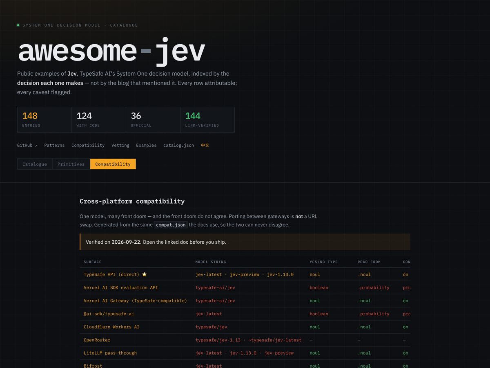

# Cross-platform compatibility

One model, many front doors — and the front doors do not agree. The same request
needs a different model string, a different field name for the yes/no type, a
different request envelope and a different environment variable depending on how
you reach it. **Porting code between gateways is not a URL swap.**

This page exists because that is the most expensive thing to discover by
debugging.

> **How this page is maintained.** The tables below are generated from
> [`../compat.json`](../compat.json) by
> [`../scripts/build_compat.py`](../scripts/build_compat.py), which is the same
> source the [Compatibility view on the site](https://kydlikebtc.github.io/awesome-jev/?view=compat)
> reads. CI fails if they drift. The prose between the tables is hand-written.
>
> **Provenance.** The native row was read directly from the official raw
> Markdown docs. Every other row was read from that platform's own
> documentation, cited in that platform's catalog row. Where a detail could not
> be confirmed from a primary source it is a dash rather than a guess.
> Everything here was true on 2026-09-22; **open the linked doc before you
> ship.**

The same data [on the site](https://kydlikebtc.github.io/awesome-jev/?view=compat), where a cell is red when it
differs from the native surface and green when it matches — which is the fastest way to see where a port will break.

---

## 1. Model string

There is no portable model string. This is the most common porting bug.

<!-- models:start -->
| Surface | Model string to send |
| --- | --- |
| [TypeSafe API (direct) ⭐](https://docs.typesafe.ai/api) | `jev-latest` · `jev-preview` · `jev-1.13.0` |
| [Vercel AI SDK evaluation API](https://vercel.com/kb/guide/typesafe-jev-and-ai-sdk) | `typesafe-ai/jev` |
| [Vercel AI Gateway (TypeSafe-compatible)](https://vercel.com/docs/ai-gateway/sdks-and-apis/typesafe) | `typesafe-ai/jev` |
| [@ai-sdk/typesafe-ai](https://ai-sdk.dev/providers/ai-sdk-providers/typesafe-ai) | `jev-latest` |
| [Cloudflare Workers AI](https://developers.cloudflare.com/ai/models/typesafe/jev/) | `typesafe/jev` |
| [OpenRouter](https://openrouter.ai/typesafe) | `typesafe/jev-1.13` · `~typesafe/jev-latest` |
| [LiteLLM pass-through](https://docs.litellm.ai/docs/pass_through/typesafe) | `jev-latest` · `jev-1.13.0` · `jev-preview` |
| [Bifrost](https://github.com/maximhq/bifrost/tree/dev/core/providers/typesafe) | `jev-latest` |
| [AI/ML API](https://docs.aimlapi.com/api-references/decision-models/typesafe/jev) | `typesafe/jev` |
| [Netlify AI Gateway](https://www.netlify.com/changelog/typesafe-jev-ai-gateway/) | `jev-latest (default)` |
| [Pydantic AI](https://pydantic.dev/docs/ai/models/typesafe/) | `typesafe:jev-latest` |
| [LangChain](https://docs.langchain.com/oss/python/integrations/providers/typesafe) | — |
| [rig (Rust)](https://github.com/0xPlaygrounds/rig) | — |
<!-- models:end -->

**Pin a version rather than an alias** once you have tuned any threshold. An
alias moves when a release ships, and the answers behind it can change with no
change on your side. The response reports the versioned ID that actually
answered, so log it.

`typesafe/jev-1` does not exist on any surface. It appears in no documentation
and is the single most repeated fabrication about this model.

---

## 2. The yes/no primitive is named twice

This one silently changes your code, not just your config.

<!-- yesno:start -->
| Surface | Type name | Read the answer from |
| --- | --- | --- |
| [TypeSafe API (direct) ⭐](https://docs.typesafe.ai/api) | `noul` | `.noul` |
| [Vercel AI SDK evaluation API](https://vercel.com/kb/guide/typesafe-jev-and-ai-sdk) | `boolean` | `.probability` |
| [Vercel AI Gateway (TypeSafe-compatible)](https://vercel.com/docs/ai-gateway/sdks-and-apis/typesafe) | `noul` | `.noul` |
| [@ai-sdk/typesafe-ai](https://ai-sdk.dev/providers/ai-sdk-providers/typesafe-ai) | `boolean` | `.probability` |
| [Cloudflare Workers AI](https://developers.cloudflare.com/ai/models/typesafe/jev/) | `noul` | `.noul` |
| [OpenRouter](https://openrouter.ai/typesafe) | — | — |
| [LiteLLM pass-through](https://docs.litellm.ai/docs/pass_through/typesafe) | `noul` | `.noul` |
| [Bifrost](https://github.com/maximhq/bifrost/tree/dev/core/providers/typesafe) | `noul` | `.noul` |
| [AI/ML API](https://docs.aimlapi.com/api-references/decision-models/typesafe/jev) | `noul` | `.noul` |
| [Netlify AI Gateway](https://www.netlify.com/changelog/typesafe-jev-ai-gateway/) | `noul` | `.noul` |
| [Pydantic AI](https://pydantic.dev/docs/ai/models/typesafe/) | `via output_type` | `typed output` |
| [LangChain](https://docs.langchain.com/oss/python/integrations/providers/typesafe) | `Noul()` | `.nouls[k].noul` |
| [rig (Rust)](https://github.com/0xPlaygrounds/rig) | `noul` | `.noul` |
<!-- yesno:end -->

Both spellings are the same primitive. Moving from an evaluation-API path to a
native path means every `type: 'boolean'` becomes `type: 'noul'` and every
`.probability` becomes `.noul`.

Note that one gateway exposes **both** routes with **different** spellings. Pick
one route and stay on it.

---

## 3. Where confidence lives

<!-- confidence:start -->
| Surface | Where `choice` / `score` confidence lives |
| --- | --- |
| [TypeSafe API (direct) ⭐](https://docs.typesafe.ai/api) | on the answer |
| [Vercel AI SDK evaluation API](https://vercel.com/kb/guide/typesafe-jev-and-ai-sdk) | providerMetadata |
| [Vercel AI Gateway (TypeSafe-compatible)](https://vercel.com/docs/ai-gateway/sdks-and-apis/typesafe) | on the answer |
| [@ai-sdk/typesafe-ai](https://ai-sdk.dev/providers/ai-sdk-providers/typesafe-ai) | providerMetadata |
| [Cloudflare Workers AI](https://developers.cloudflare.com/ai/models/typesafe/jev/) | on the answer |
| [OpenRouter](https://openrouter.ai/typesafe) | — |
| [LiteLLM pass-through](https://docs.litellm.ai/docs/pass_through/typesafe) | on the answer |
| [Bifrost](https://github.com/maximhq/bifrost/tree/dev/core/providers/typesafe) | on the answer |
| [AI/ML API](https://docs.aimlapi.com/api-references/decision-models/typesafe/jev) | on the answer |
| [Netlify AI Gateway](https://www.netlify.com/changelog/typesafe-jev-ai-gateway/) | on the answer |
| [Pydantic AI](https://pydantic.dev/docs/ai/models/typesafe/) | — |
| [LangChain](https://docs.langchain.com/oss/python/integrations/providers/typesafe) | on the answer |
| [rig (Rust)](https://github.com/0xPlaygrounds/rig) | on the answer |
<!-- confidence:end -->

And on every surface: **`noul` answers carry no confidence at all.** The
probability is the answer. A helper that reads `.confidence` uniformly across
all three types will return nothing for a third of your questions.

---

## 4. Request shape and endpoint

<!-- envelope:start -->
| Surface | Request shape | Endpoint |
| --- | --- | --- |
| [TypeSafe API (direct) ⭐](https://docs.typesafe.ai/api) | top level | `POST /v1/systemone` |
| [Vercel AI SDK evaluation API](https://vercel.com/kb/guide/typesafe-jev-and-ai-sdk) | evaluate() | — |
| [Vercel AI Gateway (TypeSafe-compatible)](https://vercel.com/docs/ai-gateway/sdks-and-apis/typesafe) | top level | `POST /typesafe/v1/systemone` |
| [@ai-sdk/typesafe-ai](https://ai-sdk.dev/providers/ai-sdk-providers/typesafe-ai) | evaluate() | — |
| [Cloudflare Workers AI](https://developers.cloudflare.com/ai/models/typesafe/jev/) | wrapped in input | `env.AI.run()` |
| [OpenRouter](https://openrouter.ai/typesafe) | — | `a decisions endpoint, separate from chat` |
| [LiteLLM pass-through](https://docs.litellm.ai/docs/pass_through/typesafe) | top level | `POST /typesafe/v1/systemone` |
| [Bifrost](https://github.com/maximhq/bifrost/tree/dev/core/providers/typesafe) | top level | `POST /typesafe/v1/systemone` |
| [AI/ML API](https://docs.aimlapi.com/api-references/decision-models/typesafe/jev) | top level | `POST /v1/decisions` |
| [Netlify AI Gateway](https://www.netlify.com/changelog/typesafe-jev-ai-gateway/) | top level | `official SDK, zero config` |
| [Pydantic AI](https://pydantic.dev/docs/ai/models/typesafe/) | Agent(...) | — |
| [LangChain](https://docs.langchain.com/oss/python/integrations/providers/typesafe) | classifier.invoke({...}) | — |
| [rig (Rust)](https://github.com/0xPlaygrounds/rig) | typed builder | — |
<!-- envelope:end -->

The surfaces exposing `/typesafe/v1/systemone` are the ones where the official
SDK works by changing only the base URL. That is the cheapest migration path if
you expect to move. One surface wraps `state` and `questions` inside an `input`
object, so a native client cannot be ported to it by swapping the URL alone.

---

## 5. Environment variable

<!-- env:start -->
| Surface | Environment variable |
| --- | --- |
| [TypeSafe API (direct) ⭐](https://docs.typesafe.ai/api) | `TYPESAFE_API_KEY` |
| [Vercel AI SDK evaluation API](https://vercel.com/kb/guide/typesafe-jev-and-ai-sdk) | `AI_GATEWAY_API_KEY` |
| [Vercel AI Gateway (TypeSafe-compatible)](https://vercel.com/docs/ai-gateway/sdks-and-apis/typesafe) | `AI_GATEWAY_API_KEY` |
| [@ai-sdk/typesafe-ai](https://ai-sdk.dev/providers/ai-sdk-providers/typesafe-ai) | `TYPESAFE_AI_API_KEY` |
| [Cloudflare Workers AI](https://developers.cloudflare.com/ai/models/typesafe/jev/) | `Workers AI binding` |
| [OpenRouter](https://openrouter.ai/typesafe) | `OPENROUTER_API_KEY` |
| [LiteLLM pass-through](https://docs.litellm.ai/docs/pass_through/typesafe) | `TYPESAFE_API_KEY` |
| [Bifrost](https://github.com/maximhq/bifrost/tree/dev/core/providers/typesafe) | `TYPESAFE_BASE_URL` |
| [AI/ML API](https://docs.aimlapi.com/api-references/decision-models/typesafe/jev) | `AIMLAPI key` |
| [Netlify AI Gateway](https://www.netlify.com/changelog/typesafe-jev-ai-gateway/) | `none` |
| [Pydantic AI](https://pydantic.dev/docs/ai/models/typesafe/) | `TYPESAFE_API_KEY` |
| [LangChain](https://docs.langchain.com/oss/python/integrations/providers/typesafe) | `TYPESAFE_API_KEY` |
| [rig (Rust)](https://github.com/0xPlaygrounds/rig) | `JEV_TOKEN` |
<!-- env:end -->

Three different names for the same secret is a real source of "it works locally
but not in CI".

---

## 6. Per-surface notes

<!-- notes:start -->
| Surface | Worth knowing |
| --- | --- |
| [TypeSafe API (direct) ⭐](https://docs.typesafe.ai/api) | The reference surface. Everything else is measured against this. |
| [Vercel AI SDK evaluation API](https://vercel.com/kb/guide/typesafe-jev-and-ai-sdk) | The one surface that renames the primitive. Needs AI SDK 7.0.105 or newer. |
| [Vercel AI Gateway (TypeSafe-compatible)](https://vercel.com/docs/ai-gateway/sdks-and-apis/typesafe) | Same gateway as the row above, different route, different spelling. Pick one and stay on it. |
| [@ai-sdk/typesafe-ai](https://ai-sdk.dev/providers/ai-sdk-providers/typesafe-ai) | Note the env var: TYPESAFE_AI_API_KEY, not TYPESAFE_API_KEY. |
| [Cloudflare Workers AI](https://developers.cloudflare.com/ai/models/typesafe/jev/) | The envelope differs: state and questions sit inside an `input` object. A native client cannot be ported by swapping the URL. |
| [OpenRouter](https://openrouter.ai/typesafe) | Note the tilde on the alias. The listing page carries no code sample, so the request shape was left unrecorded rather than guessed. |
| [LiteLLM pass-through](https://docs.litellm.ai/docs/pass_through/typesafe) | Exposes the native path, so the official SDK works by changing only the base URL. |
| [Bifrost](https://github.com/maximhq/bifrost/tree/dev/core/providers/typesafe) | One-to-one pass-through of the native API. |
| [AI/ML API](https://docs.aimlapi.com/api-references/decision-models/typesafe/jev) | A third endpoint path. Top-level envelope like native, but not at the native path. |
| [Netlify AI Gateway](https://www.netlify.com/changelog/typesafe-jev-ai-gateway/) | The lowest-friction route if you already deploy there: no key, no base URL, billed through the platform. Node.js 20+. |
| [Pydantic AI](https://pydantic.dev/docs/ai/models/typesafe/) | Maps Python types onto primitives: bool becomes a noul, Literal becomes a choice, an ordered IntEnum becomes a score. |
| [LangChain](https://docs.langchain.com/oss/python/integrations/providers/typesafe) | Accessor differs from the quickstart's: .nouls[key] rather than .answers[key]. Follow whichever your SDK version documents. |
| [rig (Rust)](https://github.com/0xPlaygrounds/rig) | A third env var name, and the 255-option cap is enforced at compile time. |
<!-- notes:end -->

---

## Hard limits

Properties of the model, so they hold on every surface.

<!-- limits:start -->
|  | Limit | Why it matters |
| --- | --- | --- |
| **choice options** | max 255 | Walk a hierarchy with a beam search over probabilities to get past it. |
| **score levels** | 2 to 10, 0-indexed, ordered low to high | A score is probability-weighted, so it lands between levels. Do not assume an integer. |
| **context** | 64k tokens per request; 32k for state plus the longest question | No tokenizer is published, which is why at least one production integration budgets in UTF-8 bytes with headroom. |
| **input** | text only: string, JSON object, or array of text | No image, audio or video. Pre-process to text or to typed fields. |
| **output tokens** | free; the model generates no text | Only input is charged, which is what makes per-item judgement at scale affordable. |
| **streaming** | not supported anywhere | The upstream API does not stream, so no gateway can add it. |
| **self-hosting** | impossible; no published weights | Anything that runs locally is a different model with a compatible wire format. Calibration does not transfer, so neither do thresholds. |
<!-- limits:end -->

---

## SDK naming, Python versus JavaScript

|                  | Python                             | JavaScript                                 |
| ---------------- | ---------------------------------- | ------------------------------------------ |
| Package          | `typesafe-sdk`                     | `@typesafe-ai/sdk`                         |
| Method           | `client.system_one(...)`           | `client.systemOne(...)`                    |
| Question helpers | classes: `Choice`, `Score`, `Noul` | functions: `choice()`, `score()`, `noul()` |

Two answer-access patterns also appear across published examples:
`response.answers["key"]` and `response.nouls["key"]` / `.choices` / `.scores`.
Follow whichever your own SDK version's docs show, and do not mix them.

---

## What is not portable at all

- **Thresholds across question types.** A cutoff tuned on a `noul` probability
  is not a `choice` confidence. The vendor's own limitations doc makes this
  point explicitly.
- **Thresholds across model versions.** Pin the version if you have tuned any.
- **Thresholds onto a compatible reimplementation.** A matching wire format
  implies nothing about calibration. See the `alternative` rows in the catalog.
- **Option ordering.** One independent test found that reversing option order
  moved a probability enough to cross a 0.9 threshold. It is unreplicated, so
  treat the magnitude as indicative — but if it reproduces for your workload,
  freeze option order and treat it as part of your prompt.

---

## Corrections this page exists to prevent

Claims that circulate but are wrong, each checked against a primary source:

| Claim                                            | Reality                                                                                                                                                                                                     |
| ------------------------------------------------ | ----------------------------------------------------------------------------------------------------------------------------------------------------------------------------------------------------------- |
| The model ID is `jev-1`                          | It is `jev-1.13.0`, with aliases `jev-latest` and `jev-preview`.                                                                                                                                            |
| `typesafe/jev-1` is a gateway model string       | It exists nowhere. Each gateway has its own string — see §1.                                                                                                                                                |
| The yes/no type is called "Binary"               | It is `noul`. One SDK spells it `boolean`; much of the press coverage got it wrong.                                                                                                                         |
| All three primitives carry confidence            | `noul` does not. Its probability _is_ the answer.                                                                                                                                                           |
| `jevai.org` is the official site                 | It is an unaffiliated community site running a separate API with a different endpoint, request shape and keys. Its `/jev-api` page documents a shape matching no primary source — do not copy code from it. |
| You can run Jev locally                          | No weights are published. Content titled "run Jev locally" describes a substitute.                                                                                                                          |
| The 193.6x / 444.6x / 67.8% figures are measured | They are vendor-run, with reference answers derived from other models' judgements rather than human ground truth. The vendor's own launch post calls the headline numbers an upper bound.                   |
| There is a paper on the training method          | There is not. An unrelated 2023 paper abbreviates to the same four letters.                                                                                                                                 |
